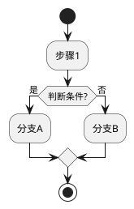
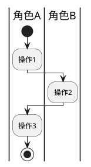

# Skill: Functional List Refinement (功能列表梳理)

## 技能用途

基于用例文档进行功能拆解，分析功能业务规则与约束，评估功能对现有系统的影响，产出结构化功能列表。

## 何时加载此技能

- 当workflow状态为 `functionalRefinement`
- 当需要从用例中提取功能列表时
- 当需要分析功能对现有系统的影响时
- 当需要进行功能优先级排列时

## 核心指导原则

### 1. 功能提取方法论

**从用例到功能的映射：**

```
用例主流程     → 核心功能
用例备选流程   → 可选功能/分支功能
用例异常处理   → 容错/降级功能
用例业务规则   → 功能规则约束
用例非功能需求 → 性能/安全约束
```

**功能粒度控制：**

```
太粗：整个模块作为一个功能
合适：单一职责、独立可实现、独立可测试
太细：每个字段验证都是一个功能
```

**新增 vs 修改功能识别：**

- **新增功能**：用例描述的全新业务能力，现有系统中不存在对应实现
- **修改功能**：用例描述的业务变化，需要调整现有功能的行为或规则

### 2. 功能列表输出格式

**主要输出文件：** `{功能名}功能列表.md`

参见 `references/functional-list-template.md` 了解功能列表模板格式。

**辅助输出文件（仅高风险功能需要）：** `{功能名}FMEA.md`

参见 `references/fmea-template.md` 了解FMEA模板格式。

### 3. 活动图分析（PlantUML）

**何时必须使用活动图：**
- 用例流程复杂，包含多个分支和判断
- 涉及多个系统或角色交互
- 需要清晰展示业务流程流转
- 异常处理路径较多

**活动图分析原则：**
- 使用 PlantUML 语法绘制
- 复杂流程必须使用泳道区分角色/系统
- 覆盖主流程、备选流程、异常流程
- 活动图嵌入功能列表文档的功能分析思路部分

**PlantUML 活动图基本语法：**



**泳道活动图（多角色协作）：**



## 实战工作流程

### 功能分析四步法

```
步骤1: 读取用例文档
  ↓ 提取主流程、备选流程、异常流程
步骤2: 功能拆解
  ↓ 将每个流程拆解为功能点，识别新增/修改功能
步骤3: 规则与约束梳理
  ↓ 为每个功能整理业务规则和约束条件
步骤4: 影响分析
  ↓ 填写功能影响分析表格，评估对现有功能的影响
```

### 与用户协作模式

**功能确认对话：**

```
"我从用例中提取了X个功能点：

【新增功能】
- F001 用户登录认证（Must）
- F002 登录状态管理（Must）

【修改功能】
- F005 用户管理（需增加角色字段）（Should）

请确认：
1. 功能拆分是否合理？
2. 是否有遗漏的功能？
3. 优先级是否准确？"
```

**影响分析确认：**

```
"新功能'会员等级'会影响现有功能：
- 积分系统（改）：需增加等级字段
- 用户画像（改）：需关联等级数据

是否需要调整现有功能设计？"
```

### 草稿管理模板

```markdown
# 功能列表梳理工作草稿

## 用例到功能映射
- UC-001 用户登录 → F001（新增：登录认证）
- UC-002 商品浏览 → F002（新增：商品查询）

## 功能影响识别
- F001 登录认证：影响 F010（会话管理，改），F011（日志记录，改）
- F002 商品查询：无影响现有功能

## 优先级排列 (MoSCoW)
- Must: F001, F002
- Should: F003
- Could: F004
- Won't: F005

## 待确认问题
- [ ] F003 的业务规则边界是否完整？
- [ ] 影响现有功能时，是否需要版本兼容？
```

## 质量检查清单

```
□ 所有用例都已映射到功能（新增/修改标注清晰）
□ 每个功能都有清晰的功能内容描述（1-2句话）
□ 每个功能的业务规则已整理
□ 每个功能的约束条件已列出
□ 功能影响分析表格已填写
□ 所有功能都已标注MoSCoW优先级
□ 复杂用例已使用活动图分析（PlantUML）
□ 活动图流程完整，覆盖主流程、备选流程、异常流程
□ 高风险功能已识别，准备FMEA分析
```

## 成功标准

**该阶段成功的标志：**

1. ✅ 功能列表完整，覆盖所有用例
2. ✅ 每个功能有清晰的业务规则和约束
3. ✅ 功能影响分析到位
4. ✅ MoSCoW优先级设置合理
5. ✅ 文档结构清晰、内容完整
6. ✅ 用户确认功能列表
7. ✅ 通过HCritic审查

**准备进入下一阶段的信号：**

- 功能列表可作为开发任务拆分的基础
- 业务规则和约束已明确
- 影响评估可指导现有功能调整
- 高风险功能已完成FMEA分析
- 无阻塞性业务问题
