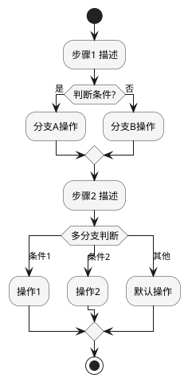
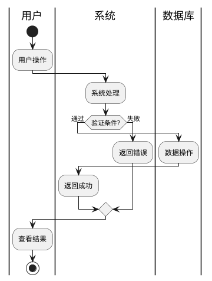
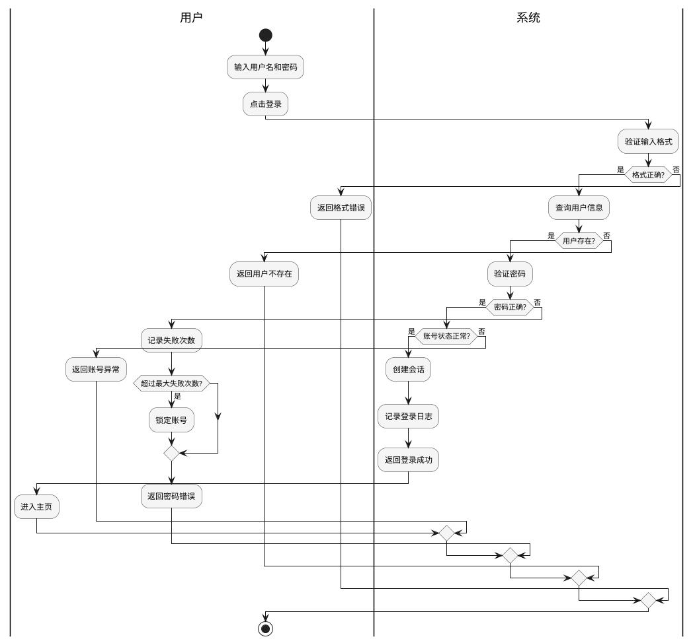

# 功能列表文档模板

## 文档结构

**输出文件：** `{功能名}功能列表.md`

```markdown
# {系统名称} 功能列表

## 功能分析思路与结果总结

[简要描述分析方法：从用例到功能的映射，哪些用例需要新增功能，哪些用例修改现有功能]

示例：
- UC-001 用户登录 → 新增功能 F001（登录认证）
- UC-002 权限管理 → 修改功能 F005（用户管理），新增功能 F006（角色配置）

## 功能描述

### 功能 1 名称

**功能内容**: [1-2 句话描述功能做什么]

**功能规则**: [业务规则，例如：密码必须至少8位，包含字母和数字]

**功能约束**: [约束条件，例如：同一账号每天最多登录失败5次]

**功能影响分析表格**:

| 功能编号 | 功能描述 | 影响类型 (增/删/改) | 影响描述 |
|---------|---------|-----------------|---------|
| F001 | [描述] | 增 | [描述] |
| F002 | [描述] | 改 | [描述] |

**优先级**: Must/Should/Could/Won't (MoSCoW)

### 功能 2 名称

...

---

如存在高风险功能，请参阅独立交付物：`{功能名}FMEA.md`
```

## 活动图分析模板（PlantUML）

**何时使用活动图：**
- 用例流程复杂，包含多个分支和判断
- 涉及多个系统或角色交互
- 需要清晰展示业务流程流转
- 异常处理路径较多

**PlantUML 活动图模板：**



**带泳道的活动图模板（多角色协作）：**



## 示例：用户登录功能

```markdown
# 用户认证系统 功能列表

## 功能分析思路与结果总结

从用例 UC-001 用户登录 中提取功能：
- 主流程 → 新增功能 F001（登录认证）
- 异常流程 → 新增功能 F002（登录失败处理）
- 安全需求 → 新增功能 F003（会话管理）

### 登录流程活动图分析



## 功能描述

### F001 登录认证

**功能内容**: 验证用户身份，创建登录会话，返回认证结果。

**功能规则**: 
- 用户名：4-20位字母、数字或下划线
- 密码：8-20位，必须包含字母和数字
- 连续失败5次锁定账号30分钟

**功能约束**: 
- 会话有效期：24小时
- 同一账号同时只能在一个设备登录

**功能影响分析表格**:

| 功能编号 | 功能描述 | 影响类型 | 影响描述 |
|---------|---------|---------|---------|
| F001 | 登录认证 | 增 | 新增登录接口和会话管理 |
| F010 | 用户管理 | 改 | 需增加登录状态字段 |
| F011 | 日志记录 | 改 | 需增加登录日志类型 |

**优先级**: Must

### F002 登录失败处理

**功能内容**: 记录登录失败次数，超过阈值锁定账号。

**功能规则**: 
- 失败次数累计周期：30分钟
- 锁定时长：30分钟
- 锁定后需管理员解锁或等待自动解锁

**功能约束**: 
- 失败记录需持久化存储
- 支持管理员手动解锁

**功能影响分析表格**:

| 功能编号 | 功能描述 | 影响类型 | 影响描述 |
|---------|---------|---------|---------|
| F002 | 登录失败处理 | 增 | 新增失败记录表 |
| F010 | 用户管理 | 改 | 需增加锁定状态字段 |

**优先级**: Must

---

如存在高风险功能，请参阅独立交付物：`用户认证FMEA.md`
```

## 质量检查清单

```
□ 功能分析思路与结果总结清晰
□ 每个功能都有清晰的功能内容描述
□ 每个功能的业务规则已整理
□ 每个功能的约束条件已列出
□ 功能影响分析表格已填写
□ 所有功能都已标注MoSCoW优先级
□ 复杂用例已使用活动图分析
□ 活动图流程完整，分支覆盖全面
□ 高风险功能已识别，准备FMEA分析
```
