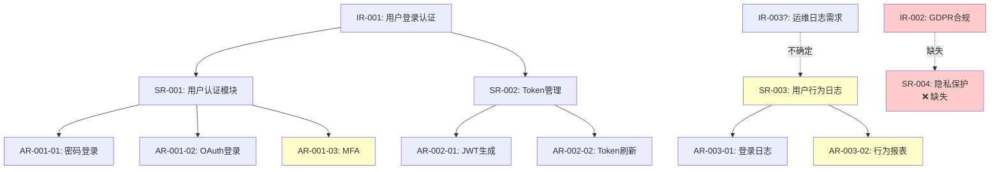

# Example Traceability Report

This example demonstrates a complete IR-SR-AR traceability analysis for a simplified authentication system.

## Scenario

**Project**: E-commerce Platform Authentication
**Documents Analyzed**:
- `需求信息.md` - Contains 2 IRs about user authentication
- `SR-AR分解分配表.md` - Contains 3 SRs and 7 ARs
- Code context gathered via LSP analysis

---

# IR-SR-AR 追溯性分析报告

**Project**: E-commerce Platform Authentication
**Analysis Date**: 2026-02-06
**Analyzed Files**:
- IR: 需求信息.md
- SR-AR: SR-AR分解分配表.md
- Code Context: LSP analysis + codebase exploration

---

## 一致性评分 (Consistency Score)

**总分: 72 / 100**

- IR-SR 追溯完整性: 32 / 40 (缺少1个SR,1个孤立SR)
- SR-AR 追溯完整性: 32 / 40 (缺少1个AR集合,1个孤立AR)
- 描述质量 (5W2H): 8 / 20 (2个SR的Why字段不明确,1个SR缺少How Much)

**评级**: 需改进 (Needs Improvement) - 需解决高优先级追溯性问题

---

## 追溯性矩阵 (Traceability Matrix)

### IR → SR Mapping

| IR ID | IR Summary | Mapped SRs | Status |
|-------|-----------|------------|--------|
| IR-001 | 用户需要安全可靠的登录认证机制 | SR-001, SR-002 | ✅ |
| IR-002 | 用户数据需符合GDPR隐私保护要求 | (none) | ❌ 缺少SR分解 |

### SR → AR Mapping

| SR ID | SR Name | Mapped ARs | IR Source | Status |
|-------|---------|------------|-----------|--------|
| SR-001 | 用户认证模块 | AR-001-01, AR-001-02, AR-001-03 | IR-001 | ✅ |
| SR-002 | Token管理模块 | AR-002-01, AR-002-02 | IR-001 | ✅ |
| SR-003 | 用户行为日志 | AR-003-01, AR-003-02 | (none) | ⚠️ 无IR支撑 |

---

## 一致性问题警示 (Consistency Warnings)

### 高优先级 - 实现缺失 (Missing Implementation)

#### 问题1: IR-002 无对应SR
**IR-002: 用户数据需符合GDPR隐私保护要求**
- **问题**: 该IR在初始需求中明确提出,但在SR-AR分解中完全缺失
- **影响**: GDPR合规是法律要求,遗漏将导致产品无法在欧盟地区上线
- **追溯链**: IR-002 → ❌ (无SR) → (无AR)
- **建议**: 
  1. 紧急补充 SR-004: 用户隐私保护模块
  2. 该SR应包含ARs: 数据加密存储、用户同意管理、数据删除接口
  3. 参考GDPR Article 17 (Right to erasure) 和 Article 25 (Data protection by design)

### 高优先级 - 过度设计 (Over-Design)

#### 问题2: SR-003 无IR支撑
**SR-003: 用户行为日志**
- **问题**: 该SR及其2个ARs无法追溯到任何IR需求
- **影响**: 增加开发工作量约0.8K,但无明确业务价值
- **追溯链**: (无IR) → SR-003 → AR-003-01, AR-003-02
- **分析**:
  - 查看SR-003的"Why"字段: "为了监控用户行为" - 未指向具体IR
  - 查看ARs:
    - AR-003-01: 记录用户登录日志 (可能隐含在运维需求中)
    - AR-003-02: 生成用户行为报表 (与初始需求无关)
- **建议**:
  1. 若确实是运维/安全审计需求,补充IR-003明确说明
  2. 若非核心需求,建议移至二期开发
  3. AR-003-02 "用户行为报表" 看起来是功能蔓延,建议移除

### 中优先级 - 描述质量问题

#### 问题3: SR-001 的 5W2H 不完整
**SR-001: 用户认证模块**
- **问题**: "Why" 字段内容为 "需求要求",未明确指向IR-001
- **影响**: 追溯性弱,审查时难以验证该SR是否真实反映IR意图
- **建议**: 修改为 "基于IR-001的用户登录安全需求,确保只有授权用户能访问系统"

#### 问题4: SR-002 缺少 "How Much"
**SR-002: Token管理模块**
- **问题**: 5W2H中缺少 "How Much" 规格约束
- **影响**: 无法评估实现规模,可能导致工作量估算偏差
- **建议**: 补充规格如 "支持10000并发用户,token有效期可配置(默认2小时),支持token刷新机制"

---

## 落地可行性分析 (Feasibility Analysis)

### AR Feasibility Summary

| AR ID | AR Name | Code Feasibility | Details |
|-------|---------|------------------|---------|
| AR-001-01 | 用户名密码登录 | ⚠️ 需修改 | 路径冲突: `/login` 已存在 |
| AR-001-02 | OAuth第三方登录 | ✅ 可行 | 依赖已安装: `passport-oauth2` |
| AR-001-03 | 多因素认证(MFA) | ❌ 依赖缺失 | 需要 `speakeasy` 库 |
| AR-002-01 | JWT生成与验证 | ✅ 可复用 | 可扩展 `TokenService.ts` |
| AR-002-02 | Token刷新机制 | ✅ 可行 | 可集成到现有refresh endpoint |
| AR-003-01 | 登录日志记录 | ✅ 已存在 | `AuditLogger.ts` 已实现 |
| AR-003-02 | 行为报表生成 | ⚠️ 需评估 | 需额外BI工具或自研 |

### Detailed Validation

#### AR-001-01: 用户名密码登录
**Status**: ⚠️ 需修改

**命名冲突**:
- **现有代码**: `src/controllers/AuthController.ts:23`
  ```typescript
  @Post('/login')
  async login(@Body() credentials: LoginDto)
  ```
- **AR设计**: POST `/api/v1/auth/login`
- **冲突分析**: 现有路径为 `/login`,AR设计为 `/api/v1/auth/login`,两者会路由冲突
- **建议**: 统一使用AR的路径设计,重构现有代码以保持一致性

**依赖可行性**: ✅
- Bcrypt密码哈希: `bcryptjs` v2.4.3 已安装
- 数据库ORM: `typeorm` v0.3.x 已配置

**复用建议**:
- **可复用**: `src/services/UserService.findByUsername()` - 用户查询
- **可复用**: `src/utils/PasswordHasher.ts` - 密码验证逻辑
- **需新增**: 登录失败次数统计和账户锁定逻辑

---

#### AR-001-03: 多因素认证(MFA)
**Status**: ❌ 依赖缺失

**依赖可行性**: ❌
- **AR要求**: 使用TOTP算法实现MFA (Time-based One-Time Password)
- **现状**: `package.json` 中未找到 `speakeasy`, `otplib` 等TOTP库
- **影响**: 无法实现该AR,除非添加依赖

**建议**:
1. **方案A (推荐)**: 安装 `speakeasy` + `qrcode` 
   ```bash
   npm install speakeasy qrcode @types/speakeasy @types/qrcode
   ```
2. **方案B**: 集成第三方MFA服务如Authy, Google Authenticator API
3. **方案C**: 若MFA非MVP需求,移至二期开发

---

#### AR-003-01: 登录日志记录
**Status**: ✅ 已存在

**现有实现**: 
- **位置**: `src/middleware/AuditLogger.ts` (lines 45-78)
- **功能**: 已实现登录事件记录,包含用户ID、IP地址、时间戳、结果
- **数据库**: `audit_logs` 表已存在,schema匹配AR需求

**建议**: 
- **直接复用**,无需重复开发
- 可能需要的扩展: 添加设备信息字段 (user-agent, device fingerprint)

---

#### AR-003-02: 用户行为报表生成
**Status**: ⚠️ 需评估

**依赖可行性**: 部分可行
- **数据源**: `audit_logs` 表可提供原始数据
- **报表工具**: 
  - 现有工具: 无内置BI或报表生成能力
  - 需要决策: 自研 vs 集成第三方 (如Metabase, Grafana)

**工作量评估**:
- 若自研: 预计1.5K - 2K工作量 (超过单个AR的0.5K上限)
- 若集成第三方: 预计0.3K - 0.5K配置工作量

**建议**: 
- 鉴于该AR无IR支撑且工作量可能超标,建议移除或降低优先级
- 若确实需要,应拆分为多个AR并补充IR

---

## 修正建议 (Correction Recommendations)

### 建议1: 补充缺失的SR-004 (GDPR合规)
**优先级**: 🔴 高 - 必须修复

针对 IR-002 "用户数据需符合GDPR隐私保护要求",需补充:

```markdown
## SR-004: 用户隐私保护模块

### SR描述 (5W2H)
- **Who**: 数据保护子系统,面向欧盟用户
- **When**: 用户注册、数据存储、数据访问全生命周期
- **What**: 
  - 实现GDPR Article 17 数据删除权
  - 实现GDPR Article 15 数据访问权
  - 用户同意管理和撤回机制
  - 数据加密存储 (at rest & in transit)
- **Where**: 数据层 (数据库、文件存储) 和API层
- **Why**: 基于IR-002的GDPR合规要求,确保产品能在欧盟合法运营
- **How Much**: 覆盖所有个人数据字段 (姓名、邮箱、地址、支付信息),预计2个冲刺
- **How**: 通过API提供数据导出和删除接口,数据库层AES-256加密敏感字段

### 关联组件
- data-protection-service: 数据加密和访问控制
- user-api: 数据导出和删除API
- consent-manager: 用户同意管理

### 分配的AR列表

#### AR-004-01: 数据加密存储
**AR描述**:
- **场景**: 用户个人数据写入数据库时
- **实现方式**: 新增功能
  - 使用AES-256加密敏感字段 (email, address, phone)
  - 密钥管理通过AWS KMS或Azure Key Vault
- **工作量估算**: 0.4K
- **分配团队**: Data Protection团队

#### AR-004-02: 用户数据导出接口
**AR描述**:
- **场景**: 用户请求导出所有个人数据 (GDPR Article 15)
- **实现方式**: 新增功能
  - API: GET `/api/v1/users/:id/export`
  - 生成JSON格式的完整数据包
  - 包含数据来源说明和处理记录
- **工作量估算**: 0.3K
- **分配团队**: User API团队

#### AR-004-03: 用户数据删除接口
**AR描述**:
- **场景**: 用户行使"被遗忘权",请求删除所有数据 (GDPR Article 17)
- **实现方式**: 新增功能
  - API: DELETE `/api/v1/users/:id/gdpr-delete`
  - 级联删除关联数据,保留必要的审计日志
  - 30天撤销期,之后永久删除
- **工作量估算**: 0.5K
- **分配团队**: User API团队
```

---

### 建议2: 处理孤立的SR-003
**优先级**: 🟡 中 - 建议修复

**问题**: SR-003 "用户行为日志" 无IR支撑

**选项A (推荐)**: 补充隐含的IR
若日志确实是运维/安全需求,补充:
```markdown
# IR-003: 系统运维需求

## 一句话总结
运维团队需要完整的用户行为审计日志,用于安全审计和故障排查

## 5W2H 结构化分析
- **Who**: 运维团队和安全审计人员
- **What**: 记录所有用户关键操作,生成审计报告
- **When**: 系统运行全周期,审计时按需查询
- **Why**: 满足SOC2合规要求,支持安全事件调查
- **Where**: 后台日志系统,对终端用户不可见
- **How Much**: 保留90天日志,支持每秒1000次写入
- **How**: 通过日志中台统一收集,提供查询和报表界面
```
然后更新SR-003的"Why"字段指向IR-003

**选项B**: 移除过度设计
若日志非核心需求,建议:
- 保留 AR-003-01 (登录日志) - 因为已有实现,且对安全有益
- 移除 AR-003-02 (行为报表) - 无明确业务价值且工作量超标

---

### 建议3: 解决AR-001-01路径冲突
**优先级**: 🟡 中 - 建议修复

**冲突**: 现有 `/login` vs AR设计 `/api/v1/auth/login`

**推荐方案**: 全局统一使用 `/api/v1` 前缀
```typescript
// 重构现有代码
// src/controllers/AuthController.ts
@Controller('api/v1/auth') // 添加统一前缀
export class AuthController {
  @Post('/login') // 路径变为 /api/v1/auth/login
  async login(@Body() credentials: LoginDto) {
    // ...
  }
}
```
**影响**: 需要更新前端API调用路径,更新API文档

---

### 建议4: 添加MFA依赖或延后需求
**优先级**: 🟡 中 - 建议修复

**问题**: AR-001-03 依赖缺失,无法实现

**推荐方案**: 
1. 若MFA是MVP必需功能,立即添加依赖:
   ```bash
   npm install speakeasy qrcode
   ```
2. 若MFA非关键路径,标记为"Phase 2"并从当前SR-AR中移除

---

## 总体评估 (Overall Assessment)

**一致性状况**: 需改进 (Needs Improvement)

**主要发现**:
1. **严重遗漏**: IR-002 (GDPR合规) 完全未被SR覆盖,存在法律风险
2. **过度设计**: SR-003 无IR支撑,AR-003-02工作量超标且价值不明
3. **技术风险**: AR-001-03依赖缺失,AR-001-01存在路径冲突
4. **描述质量**: 多个SR的5W2H不完整,影响追溯性验证

**正面评价**:
- IR-001的SR-AR分解相对完整,覆盖了主要认证场景
- 多个ARs可复用现有代码 (TokenService, AuditLogger),设计合理

**后续行动**:
- [ ] **紧急**: 补充SR-004及其ARs以覆盖IR-002 (GDPR合规)
- [ ] **重要**: 决策SR-003的去留 (补充IR-003 或 移除AR-003-02)
- [ ] **重要**: 解决AR-001-01路径冲突和AR-001-03依赖问题
- [ ] **建议**: 完善SR-001和SR-002的5W2H描述,增强追溯性
- [ ] **建议**: 更新追溯矩阵,确保所有SR明确标注IR来源

**审查结论**: ❌ 不通过

**理由**: 存在高优先级追溯性问题 (IR-002缺失SR) 和技术可行性问题 (依赖缺失、路径冲突),必须修正后才能进入下一阶段。

**预计返工时间**: 1-2个工作日,主要是补充SR-004和解决技术依赖问题。

---

## 附录: 完整追溯链



**图例**:
- 🔴 红色: 缺失或严重问题
- 🟡 黄色: 需要澄清或修正
- 虚线: 追溯链不明确
