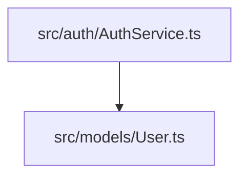
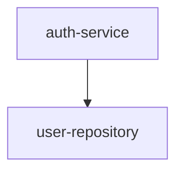
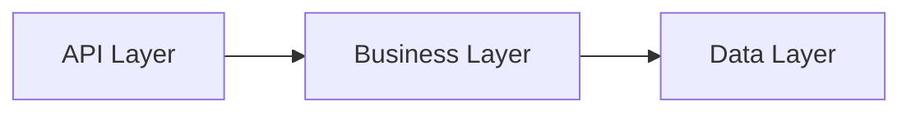
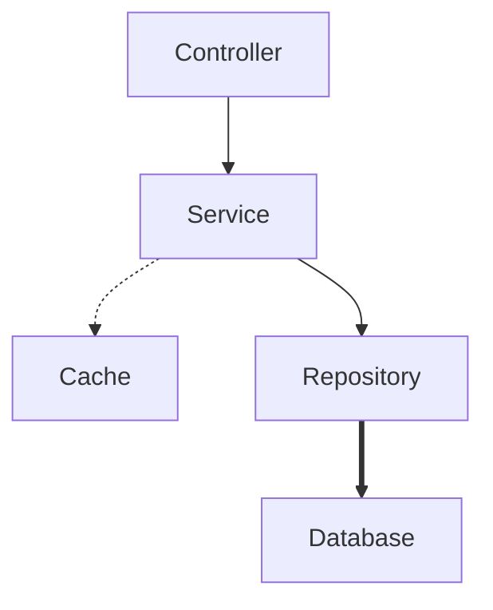
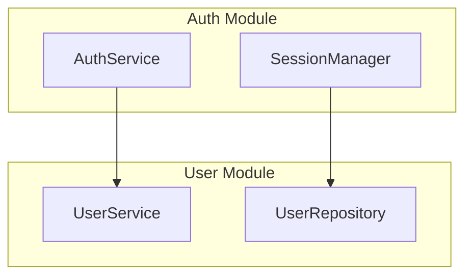
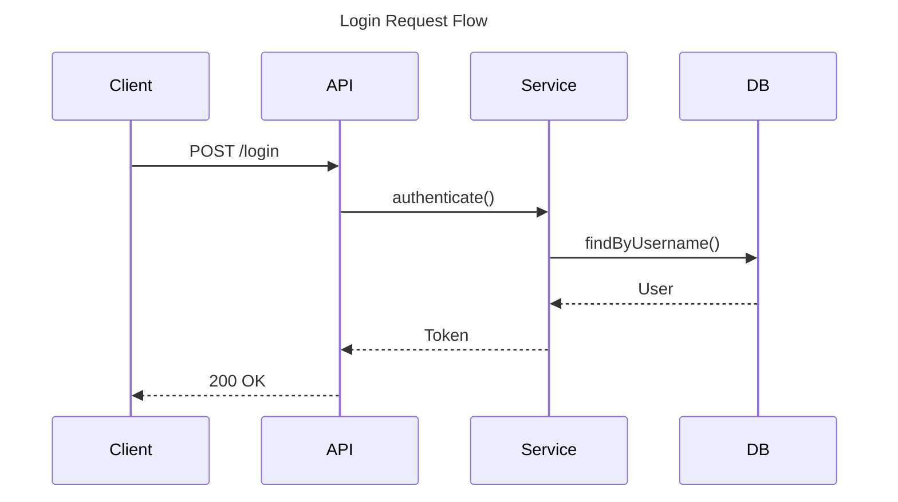
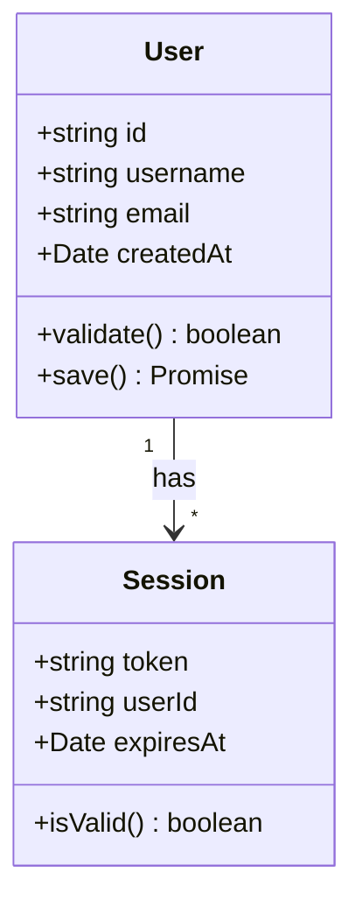
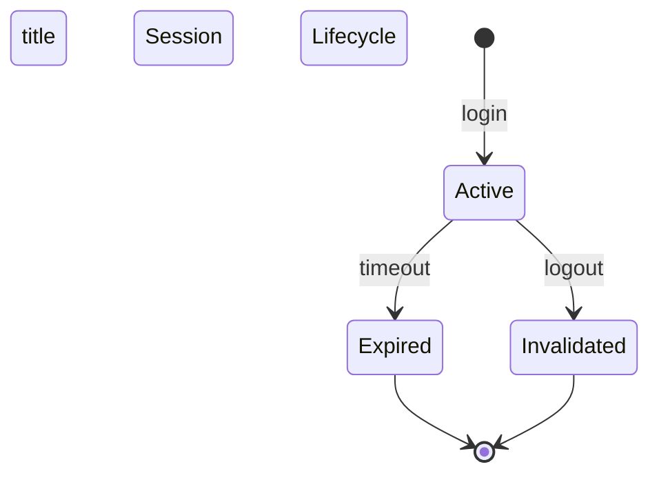
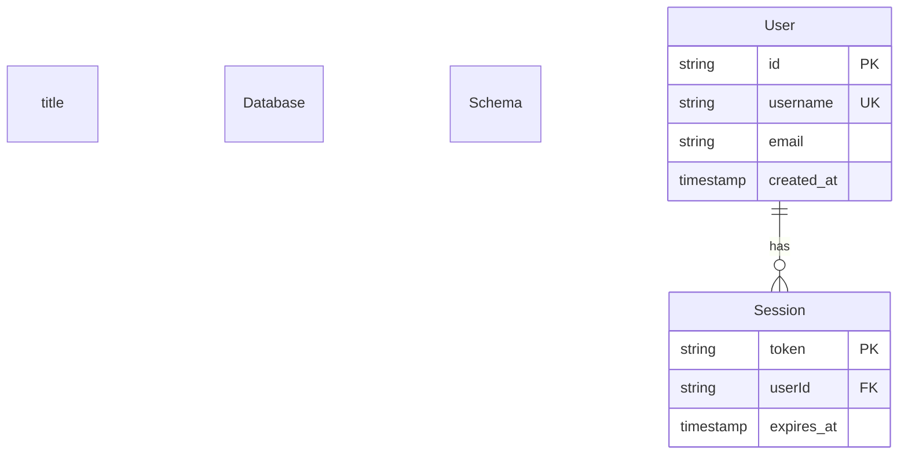
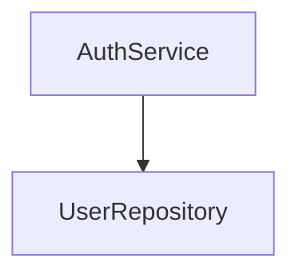

# Mermaid Conventions

All diagrams in analysis artifacts must follow these conventions for consistency and tool support.

## Supported Diagram Types

| Type | Use Case | Stage |
|------|-----------|-------|
| `graph TD` | Hierarchy, directory structure, dependency trees | All |
| `graph LR` | Flow, pipelines, interactions | All |
| `sequenceDiagram` | Request-response flows, call sequences | All |
| `classDiagram` | Data models, class structures, interfaces | All |
| `stateDiagram` | State machines, lifecycle | All |
| `erDiagram` | Database schemas, entity relationships | All |
| `gantt` | Timelines, process flows | Optional |
| `pie` | Statistics, distributions | Optional |

## Diagram Naming

Each diagram must have a descriptive title:

```mermaid
graph TD
    title System Architecture Overview
    ...
```

## Node Naming Conventions

### Files and Modules

Use full relative paths for clarity:



### Components

Use component slugs from component-manifest.json:



### Layers

Use standard layer names:



## Edge Styling

### Dependency Types

| Edge Type | Style | Meaning |
|-----------|--------|---------|
| Direct dependency | `-->` | Standard dependency |
| Weak dependency | `-.->` | Optional or indirect |
| Bidirectional | `<-->` | Circular dependency (warning) |
| Data flow | `==>` | Data movement |
| Control flow | `-->` | Execution order |

### Example



## Subgraphs

Use subgraphs to group related nodes:



## Diagram Size Limits

- **Maximum nodes**: 50 per diagram
- **Maximum edges**: 100 per diagram
- **Maximum nesting**: 5 levels deep

If diagram exceeds limits, split into multiple diagrams with clear numbering:

```mermaid
graph TD
    title Architecture Overview - Part 1: Core Modules
    ...
```

```mermaid
graph TD
    title Architecture Overview - Part 2: Utilities
    ...
```

## Diagram-Specific Conventions

### Directory Structure (graph TD)

```mermaid
graph TD
    title Project Directory Structure
    Root[src/]
    Root --> Auth[src/auth/]
    Root --> Models[src/models/]
    Root --> API[src/api/]
    Auth --> AuthService[AuthService.ts]
    Models --> User[User.ts]
    API --> Routes[routes.ts]
```

### Dependency Graph (graph TD)

```mermaid
graph TD
    title Module Dependency Graph
    A[AuthService] --> B[UserRepository]
    A --> C[SessionManager]
    B --> D[DatabaseConnection]
    C --> D
    E[APIController] --> A
```

### Data Flow (graph LR)

```mermaid
graph LR
    title Authentication Data Flow
    A[Request] --> B[Validate]
    B --> C[Authenticate]
    C --> D[Generate Token]
    D --> E[Response]
```

### Sequence Diagram (sequenceDiagram)



### Class Diagram (classDiagram)



### State Diagram (stateDiagram)



### ER Diagram (erDiagram)



## Diagram Validation Rules

Stage 3 validates all Mermaid diagrams:

1. **Syntax validity**: Diagram must parse correctly
2. **Node references**: All nodes must exist in manifests
3. **Edge consistency**: Edges must reference existing nodes
4. **Size limits**: Must not exceed node/edge limits
5. **Title presence**: All diagrams must have titles
6. **No orphan nodes**: All nodes must be connected (except roots)

## Diagram Placement

### In architecture.md

Place diagrams in relevant dimension sections:

```markdown
## 1. Structure

### Directory Organization

```mermaid
graph TD
    title Project Directory Structure
    ...
```

### Layer Architecture

```mermaid
graph LR
    title System Layers
    ...
```
```

### In component/{componentSlug}.md

Place diagrams in relevant dimension sections:

```markdown
## 2. Interfaces

### Component Dependencies

```mermaid
graph TD
    title Component Dependencies
    ...
```

## 3. Data and State

### Internal Data Flow

```mermaid
graph LR
    title Internal Data Flow
    ...
```
```

## Diagram Cross-References

Diagrams can reference each other using hyperlinks:



## Common Patterns

### Layered Architecture

```mermaid
graph LR
    title Layered Architecture Pattern
    subgraph Presentation
        A[Controllers]
        B[Views]
    end
    subgraph Business
        C[Services]
        D[Domain Models]
    end
    subgraph Data
        E[Repositories]
        F[Database]
    end
    A --> C
    B --> C
    C --> E
    D --> E
    E --> F
```

### Microservices Architecture

```mermaid
graph TD
    title Microservices Architecture
    subgraph Services
        A[Auth Service]
        B[User Service]
        C[Order Service]
    end
    subgraph Infrastructure
        D[API Gateway]
        E[Service Discovery]
        F[Message Broker]
    end
    D --> A
    D --> B
    D --> C
    A --> E
    B --> E
    C --> E
    A --> F
    B --> F
    C --> F
```

### Event-Driven Architecture

```mermaid
graph LR
    title Event-Driven Pattern
    A[Producer] -->|publish| B[Event Bus]
    B -->|subscribe| C[Consumer 1]
    B -->|subscribe| D[Consumer 2]
    B -->|subscribe| E[Consumer 3]
```

## Diagram Maintenance

All diagrams must include update reminders:

```markdown
```mermaid
graph TD
    title Current Architecture
    ...
```

> **Update Reminder**: This diagram reflects the architecture as of [Date]. When the code structure changes, update this diagram to maintain accuracy.
```

## Best Practices

### DO ✅

- Use descriptive titles
- Follow naming conventions
- Keep diagrams under size limits
- Group related nodes with subgraphs
- Use consistent edge styles
- Include update reminders
- Validate syntax before committing

### DON'T ❌

- Create overly complex diagrams
- Use abbreviations for node names
- Mix diagram types in one block
- Exceed size limits
- Omit titles
- Use inconsistent styling
- Skip validation

## Tool Support

These conventions ensure compatibility with:

- **Mermaid Live Editor**: https://mermaid.live/
- **GitHub/GitLab**: Native Mermaid rendering
- **VS Code**: Mermaid Preview extension
- **Markdown viewers**: Most support Mermaid
- **Static site generators**: Hugo, Jekyll, etc.
