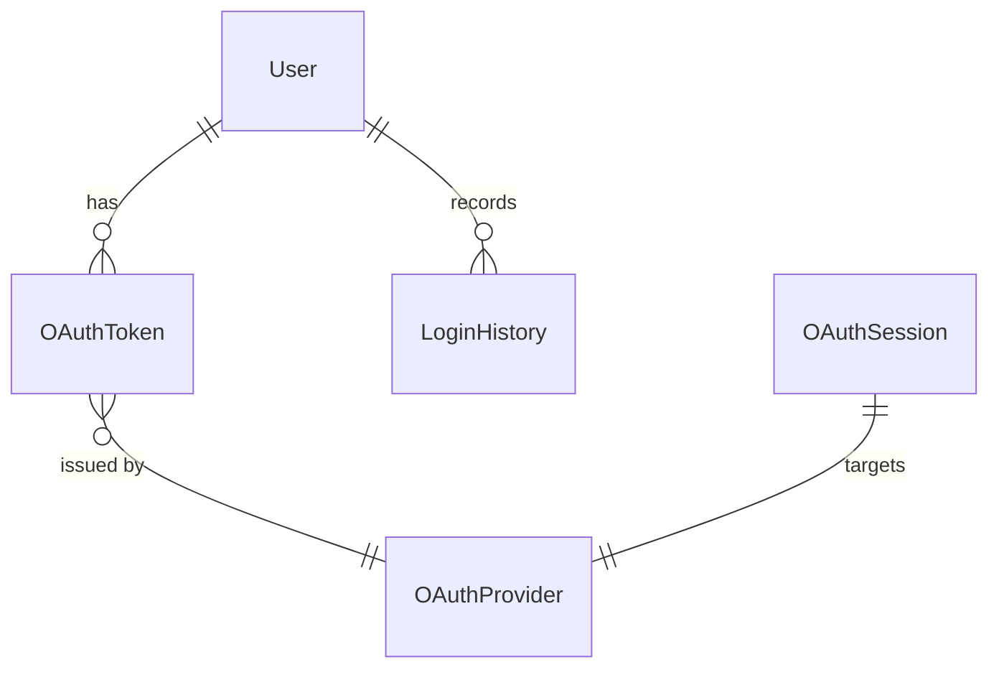
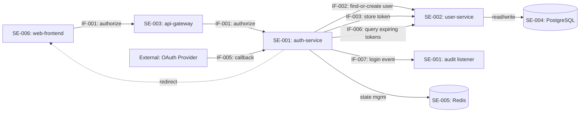

# SR-AR Decomposition Example: E-commerce User Authentication

This example demonstrates a **complete** SR-AR decomposition following the full template, including system elements, interface specifications, DFX matrices, system-level specification decomposition, and design constraints. Use this as a canonical reference for producing downstream `systemFunctionalDesign` and `moduleFunctionalDesign` artifacts.

## Input: Functional Requirement

**FR-005: 第三方账号登录**
- 用户可以使用Google或GitHub账号登录系统
- 首次登录自动创建账号
- 已有账号可关联第三方登录方式
- 预期提升注册转化率15%

**来源**: IR-005 "降低用户注册门槛，支持主流第三方账号登录"

---

# SR-AR分解分配表

## Metadata
- **项目名称**: E-commerce Platform
- **版本号**: v2.1
- **创建日期**: 2025-03-01
- **作者**: System Engineer - 张工
- **输入来源**:
  - 功能列表: `docs/功能列表-v2.1.md`
  - 组件划分: `docs/组件划分.md`
  - 架构文档: `docs/architecture-overview.md`
  - 代码库: `https://github.com/example/ecommerce-platform`

---

## 一、系统元素清单

### 1.1 架构元素定义

| 元素ID | 元素名称 | 元素类型 | 核心职责 | 所属子系统 | 依赖元素 |
|--------|---------|---------|---------|-----------|---------|
| SE-001 | auth-service | Service | 管理认证流程、OAuth集成、Token签发 | 认证子系统 | SE-003, SE-004 |
| SE-002 | user-service | Service | 用户账号管理、账号创建与关联 | 用户管理子系统 | SE-004 |
| SE-003 | api-gateway | Gateway | 路由转发、请求认证、限流 | 基础设施 | — |
| SE-004 | postgresql-db | Storage | 用户与OAuth Token持久化存储 | 基础设施 | — |
| SE-005 | redis-cache | Storage | 临时State存储、会话缓存 | 基础设施 | — |
| SE-006 | web-frontend | Module | 登录页面UI、OAuth流程交互 | 前端子系统 | SE-003 |
| SE-007 | notification-service | Service | 邮件/短信通知（账号关联确认） | 通知子系统 | — |

### 1.2 功能对象定义

| 对象ID | 对象名称 | 所属架构元素 | 核心职责 | 聚合根/实体 |
|--------|---------|------------|---------|------------|
| FO-001 | OAuthFlowManager | SE-001 | 管理OAuth授权流程（生成授权URL、处理回调、交换Token） | OAuthSession |
| FO-002 | TokenGenerator | SE-001 | JWT Token签发和验证 | JWTToken |
| FO-003 | OAuthProviderAdapter | SE-001 | 适配不同OAuth Provider（Google/GitHub）的API差异 | OAuthProvider |
| FO-004 | UserAccountManager | SE-002 | 用户账号创建、查询、关联第三方账号 | User |
| FO-005 | OAuthTokenStore | SE-002 | OAuth Token持久化管理（存储/刷新/过期清理） | OAuthToken |
| FO-006 | LoginPageController | SE-006 | 前端登录页渲染、OAuth流程发起、回调处理 | — |

### 1.3 领域数据模型

**核心数据对象**:

| 数据对象 | 所属系统元素 | 核心属性 | 生命周期 |
|---------|------------|---------|---------|
| User | SE-002 | id, email, name, avatar_url, oauth_linked_at, created_at | 注册时创建，注销时归档 |
| OAuthToken | SE-002 | id, user_id, provider, provider_user_id, access_token, refresh_token, expires_at | OAuth登录时创建，刷新时更新，解绑时删除 |
| OAuthSession | SE-001 | state, provider, redirect_uri, created_at, expires_at | 授权请求时创建(Redis)，回调后消费销毁(TTL 10min) |
| JWTToken | SE-001 | token, user_id, issued_at, expires_at | 登录成功时签发，过期后失效 |
| LoginHistory | SE-001 | id, user_id, provider, ip, user_agent, login_at, status | 每次登录尝试时创建，永久保留 |

**数据对象关系**:



**数据归属说明**:
- User, OAuthToken 由 SE-002 (user-service) 拥有和管理
- OAuthSession 由 SE-001 (auth-service) 通过 SE-005 (Redis) 临时管理
- JWTToken 由 SE-001 (auth-service) 签发，SE-003 (api-gateway) 验证
- LoginHistory 由 SE-001 (auth-service) 写入，SE-002 (user-service) 查询

---

## 二、系统设计约束

### 2.1 技术约束

| 约束ID | 约束内容 | 来源 | 影响范围 |
|--------|---------|------|---------|
| TC-001 | 后端服务必须使用 Node.js 18+ + TypeScript | 技术委员会标准 | SE-001, SE-002, SE-007 |
| TC-002 | 前端使用 React 18 + Next.js | 前端架构统一规范 | SE-006 |
| TC-003 | OAuth集成必须严格遵循 RFC 6749 和 RFC 7636 (PKCE) | 安全合规团队 | SE-001 |
| TC-004 | 所有服务间通信走 api-gateway，禁止直连 | 基础设施规范 | SE-001, SE-002, SE-007 |

### 2.2 性能约束

| 约束ID | 指标名称 | 指标要求 | 度量条件 | 影响范围 |
|--------|---------|---------|---------|---------|
| PC-001 | OAuth授权流程端到端时间 | < 3秒 (不含Provider页面停留) | P95, 100并发用户 | SE-001, SE-006 |
| PC-002 | Token签发响应时间 | P99 < 200ms | 200 TPS | SE-001 |
| PC-003 | 用户查询/创建响应时间 | P99 < 100ms | 500 TPS | SE-002 |

### 2.3 安全/韧性/隐私约束

| 约束ID | 约束类型 | 约束内容 | 合规要求 | 影响范围 |
|--------|---------|---------|---------|---------|
| SC-001 | 安全 | OAuth state参数必须使用加密随机数, 绑定到用户会话 | OWASP OAuth Security | SE-001, SE-005 |
| SC-002 | 安全 | JWT token必须使用RS256算法, 密钥轮转周期≤90天 | 内部安全规范 | SE-001, SE-003 |
| SC-003 | 隐私 | 第三方access_token必须加密存储(AES-256), 日志中不得出现明文token | GDPR | SE-002, SE-004 |
| SC-004 | 韧性 | OAuth Provider不可用时, 保留密码登录通道, 不影响其他功能 | 韧性设计准则 | SE-001, SE-006 |

### 2.4 可靠性/可用性约束

| 约束ID | 指标名称 | 目标值 | 度量方式 | 影响范围 |
|--------|---------|--------|---------|---------|
| RC-001 | 认证服务可用性 | 99.95% | 月度SLA计算 | SE-001 |
| RC-002 | 故障恢复时间(RTO) | < 2 分钟 | 自动健康检查+重启 | SE-001, SE-002 |
| RC-003 | OAuth Token刷新成功率 | > 99% | 月度统计 | SE-001, SE-002 |

### 2.5 易用性约束

| 约束ID | 约束内容 | 来源 | 影响范围 |
|--------|---------|------|---------|
| UC-001 | OAuth登录流程点击次数 ≤ 3次（点击按钮→授权→完成） | UX设计规范 | SE-006 |
| UC-002 | 登录失败必须提供明确中文错误提示和替代登录方式引导 | UX设计规范 | SE-006 |

---

## 三、系统级规格设计

### 3.1 认证性能规格设计

**设计思路**: 端到端OAuth登录流程涉及前端、auth-service、外部Provider和user-service四个环节。将3秒总预算按调用链分解到各系统功能，为每个环节分配性能预算，关键路径避免串行阻塞。

**涉及系统功能**: SR-001

**规格分解**:

| 系统级指标 | 目标值 | 分解到系统功能 | 功能级指标 | 功能级目标值 | 分解依据 |
|-----------|--------|-------------|-----------|------------|---------|
| OAuth端到端响应时间 | P95 < 3s | SR-001 (auth-service 回调处理) | 回调处理时间 | P95 < 800ms | 回调是系统可控最耗时环节(state验证+code交换+用户信息获取) |
| OAuth端到端响应时间 | P95 < 3s | SR-001 (user-service 账号操作) | 用户查询/创建时间 | P95 < 100ms | 数据库单表操作，有索引优化 |
| OAuth端到端响应时间 | P95 < 3s | SR-001 (auth-service Token签发) | JWT签发时间 | P95 < 50ms | RS256签名计算为CPU操作 |
| OAuth端到端响应时间 | P95 < 3s | SR-001 (web-frontend) | 前端重定向+渲染 | P95 < 500ms | 含浏览器重定向和SPA hydration |
| — | — | — | 外部Provider处理 | 估算 < 1500ms | 不可控环节，预留最大预算 |

### 3.2 可靠性规格设计

**设计思路**: 认证是核心链路，可靠性目标99.95%需分解到各依赖组件，对单点故障组件设计冗余。

**涉及系统功能**: SR-001

**规格分解**:

| 系统级指标 | 目标值 | 分解到系统功能 | 功能级指标 | 功能级目标值 | 分解依据 |
|-----------|--------|-------------|-----------|------------|---------|
| 认证服务可用性 | 99.95% | SR-001 (auth-service) | 服务实例可用性 | 99.98% | 部署≥2副本，单实例故障不影响整体 |
| 认证服务可用性 | 99.95% | SR-001 (Redis) | 缓存可用性 | 99.99% | Redis Sentinel模式，主从自动切换 |
| 认证服务可用性 | 99.95% | SR-001 (PostgreSQL) | 数据库可用性 | 99.99% | 主备自动切换，读写分离 |
| OAuth Token刷新成功率 | > 99% | SR-001 (Token刷新任务) | 单次刷新成功率 | > 99.5% | 含1次自动重试 |

---

## 四、SR-AR分解

### SR-001: 第三方OAuth登录集成

#### SR描述 (5W2H)

##### Who (谁)
**系统元素**: SE-001 auth-service (主要), SE-002 user-service, SE-006 web-frontend
- 关联架构元素: auth-service负责OAuth流程编排，user-service负责账号操作，web-frontend负责用户交互
- 负责团队: Auth Team (后端), User Service Team, Frontend Team

##### When (何时)
**生命周期阶段**:
- 用户访问登录页面时可选择第三方登录
- 系统启动时加载OAuth Provider配置
- 用户会话期间维持token有效性
- 继承自: IR-005

**触发条件**:
- 用户在登录页点击"使用Google登录"或"使用GitHub登录"按钮

##### What (什么)
**功能描述**:
- 新增OAuth2.0第三方登录支持(Google, GitHub)，含PKCE增强
- 首次OAuth登录自动创建本地账号
- 已有账号支持绑定/解绑第三方登录方式

**发布件变化**:
- [x] 代码模块: auth-service新增OAuth flow handler; user-service新增OAuth link API
- [x] 配置文件: OAuth Provider client_id/secret环境变量
- [x] 数据模型: 新增oauth_tokens表; users表增加oauth_linked_at字段
- [x] 接口变化: 新增4个API endpoint (authorize, callback, link, unlink)
- [x] 文档更新: API文档、运维手册(密钥轮转流程)

**测试变化**:
- 新增OAuth流程端到端测试 (含Mock Provider)
- 新增账号关联/解绑场景测试
- 新增安全测试 (CSRF via state, token泄露)

##### Where (哪里)
**运行环境**:
- 后端: Node.js 18+ (auth-service, user-service)
- 前端: React 18 + Next.js (浏览器端)

**依赖组件**:
- Google OAuth 2.0 API: 用户授权和信息获取
- GitHub OAuth Apps API: 用户授权和信息获取
- Redis 7+: OAuth state临时存储(TTL 10min)
- PostgreSQL 15: 用户和Token持久化

**部署位置**:
- auth-service: Kubernetes auth namespace, ≥2 replicas
- user-service: Kubernetes user namespace, ≥2 replicas
- web-frontend: CDN + Vercel Edge

##### Why (为何)
**需求来源**:
- 继承自: IR-005 - "降低用户注册门槛，支持主流第三方账号登录"

**业务价值**:
- 预期提升注册转化率15%
- 减少密码找回工单30%
- 降低用户注册摩擦

##### How Much (多少)
**工作量估算**:
- 总工作量: 1.5K
- 时间线: 3个冲刺(6周)
- 团队规模: 2名后端 + 1名前端 + 1名测试

**估算分解**:
```
IR-005: 1.5K
  +-- SR-001: 1.5K (IR-005只分解为一个SR)
    +-- AR-001-01: 0.30K (OAuth Provider适配器)
    +-- AR-001-02: 0.35K (账号创建/关联逻辑)
    +-- AR-001-03: 0.25K (前端OAuth登录流程)
    +-- AR-001-04: 0.30K (OAuth回调处理端点)
    +-- AR-001-05: 0.20K (Token刷新机制)
    +-- AR-001-06: 0.10K (登录审计日志)
  Total: 1.50K ✅ (匹配IR估算)
```

**范围指标**:
- API端点数: 4 (authorize, callback, link, unlink)
- 数据表数: 1新增(oauth_tokens) + 1修改(users)
- 测试用例数: 25+
- OAuth Provider: 2 (Google, GitHub)

##### How (如何)
**使用方式**:
- 用户在登录页点击"使用Google登录"
- 系统跳转到Google授权页
- 授权后自动创建或关联账号
- 返回应用，已登录状态

**工作流程**:
1. Frontend发起OAuth请求 → api-gateway → auth-service
2. auth-service(FO-001)生成state，存入Redis，返回授权URL
3. 浏览器重定向到OAuth Provider授权页
4. 用户在Provider页面完成授权
5. Provider回调至auth-service/callback，携带code和state
6. auth-service(FO-001)验证state，(FO-003)调用Provider API交换code为access_token
7. auth-service(FO-003)获取用户信息
8. auth-service调用user-service(FO-004)查询/创建用户，(FO-005)存储OAuth Token
9. auth-service(FO-002)签发JWT token
10. 重定向回Frontend，携带JWT

**集成点**:
- 复用现有api-gateway的请求路由和限流
- 复用现有SessionMiddleware验证JWT
- 调用user-service的用户管理API
- 使用统一的Redis会话存储

**价值体现**:
- 用户获得一键登录体验
- 系统获得可信第三方验证的身份信息
- 减少密码安全风险

---

#### 关联系统元素

| 系统元素ID | 元素名称 | 在本SR中的职责 | 是否新增 |
|-----------|---------|--------------|---------|
| SE-001 | auth-service | 编排OAuth流程、签发JWT、管理state | 修改(新增OAuth handler) |
| SE-002 | user-service | 查询/创建用户、存储OAuth Token | 修改(新增OAuth link API) |
| SE-003 | api-gateway | 路由OAuth相关请求、验证JWT | 修改(新增路由规则) |
| SE-004 | postgresql-db | 持久化oauth_tokens、users | 修改(新增表/字段) |
| SE-005 | redis-cache | 临时存储OAuth state | 修改(新增key pattern) |
| SE-006 | web-frontend | 登录页OAuth按钮、回调页面处理 | 修改(新增OAuth UI组件) |

---

#### DFX需求

| DFX类型 | 需求ID | 需求描述 | 优先级 | 验证方式 |
|---------|--------|---------|--------|---------|
| 可靠性 | DFX-R-001 | OAuth Provider不可用时，系统应降级到密码登录，不影响其他功能 | 高 | 故障注入测试(断开Provider连接) |
| 可靠性 | DFX-R-002 | Redis临时不可用时，OAuth流程应优雅失败并提示用户重试 | 中 | 混沌工程(Kill Redis实例) |
| 安全性 | DFX-S-001 | OAuth state必须防CSRF：加密随机数+会话绑定+TTL 10min | 高 | 安全审计 + CSRF攻击模拟 |
| 安全性 | DFX-S-002 | access_token/refresh_token必须AES-256加密存储，日志脱敏 | 高 | 渗透测试 + 日志审查 |
| 安全性 | DFX-S-003 | 防止OAuth登录绑定到他人已有账号(邮箱冲突处理) | 高 | 场景测试(已有同邮箱账号) |
| 性能 | DFX-P-001 | 回调处理(state验证+code交换+用户操作+JWT签发)总时间 P95<800ms | 高 | 压力测试(100并发) |
| 可维护性 | DFX-M-001 | OAuth流程全链路可观测：请求ID追踪、关键步骤打点、Provider响应时间监控 | 中 | 监控面板验收 |

---

#### 系统规格指标

| 指标名称 | 目标值 | 度量条件 | 来源(系统级规格) |
|---------|--------|---------|----------------|
| OAuth回调处理时间 | P95 < 800ms | 100并发用户 | 规格3.1 认证性能规格分解 |
| JWT签发时间 | P95 < 50ms | 200 TPS | 规格3.1 认证性能规格分解 |
| 用户查询/创建时间 | P95 < 100ms | 500 TPS | 规格3.1 认证性能规格分解 |
| 认证服务可用性 | 99.95% | 月度SLA | 规格3.2 可靠性规格分解 |
| Token刷新成功率 | > 99% | 月度统计 | 规格3.2 可靠性规格分解 |

---

#### 分配的AR列表

##### AR-001-01: OAuth Provider适配器实现

**AR描述**:

**场景**:
- auth-service需要调用Google和GitHub的OAuth API完成授权码交换和用户信息获取
- 前置条件: OAuth Provider已配置client_id/secret
- 后置条件: 系统持有Provider签发的access_token和标准化用户信息

**分配系统元素**: SE-001 auth-service

**实现方式**:

**选项1 (采用): 策略模式适配器**
- 位置: `auth-service/src/adapters/oauth/`
- 新增: OAuthProviderAdapter抽象接口 + GoogleAdapter + GitHubAdapter
- 统一输出: `{ provider_user_id, email, name, avatar_url }`

**选项2 (备选): 使用passport.js库**
- 调用接口: passport-google-oauth20, passport-github2
- 未采用原因: 引入过重依赖，且自定义控制力不足

**接口规格**:

| 项目 | 内容 |
|------|------|
| 接口ID | IF-001 |
| 接口名称 | OAuth授权URL生成接口 |
| 接口描述 | 生成指定Provider的OAuth授权重定向URL(含state和PKCE) |
| 接口类型 | REST API |
| 提供方系统元素 | SE-001 auth-service |
| 消费方系统元素 | SE-006 web-frontend (via SE-003 api-gateway) |
| 输入要求/参数 | `GET /v1/auth/oauth/authorize?provider={google\|github}` provider: string (必选, enum: google, github) |
| 输出要求/参数 | `302 Redirect` to Provider授权URL; Error: `{ code: "UNSUPPORTED_PROVIDER", message: string }` |
| SLA定义 | 响应时间: P99 < 100ms, 可用性: 99.95% |
| 约束和注意事项 | state必须加密随机生成(≥32字节); PKCE code_verifier存入Redis(TTL 10min); 每分钟限流100次/IP |

**数据模型**:
- [x] 新增配置: `oauth_providers` 环境变量 (provider_name, client_id, client_secret, scopes)
- [x] Redis key: `oauth:state:{state}` → `{ provider, code_verifier, redirect_uri, created_at }` (TTL: 600s)

**DFX要求**:
- 可靠性: Provider API超时(>2s)时返回标准错误，不阻塞；支持不同Provider独立降级
- 安全性: client_secret通过环境变量注入，代码中不硬编码；Provider响应需验证签名
- 性能: Provider API调用设置超时2s，含1次自动重试

**工作量估算**: 0.30K
- 估算方法: 底层估算
- 任务分解:
  - OAuthProviderAdapter接口设计: 1 day
  - GoogleAdapter实现: 3 days
  - GitHubAdapter实现: 2.5 days
  - PKCE实现: 1.5 days
  - State管理(Redis): 1 day
  - 单元测试: 2 days
  - 集成测试(Mock Provider): 2 days
  - 文档: 0.5 day
  - Buffer (20%): 2.7 days
  - **Total**: 16.2 days ≈ 0.20K → 调整含联调0.30K

**依赖关系**:
- 依赖AR: 无前置依赖(可先开发)
- 被依赖: AR-001-04 (回调处理依赖适配器)

**验收标准**:
- [ ] Google OAuth完整流程可走通(Dev环境)
- [ ] GitHub OAuth完整流程可走通(Dev环境)
- [ ] Provider不可用时返回标准化错误(非500)
- [ ] State使用加密随机数，TTL 10分钟
- [ ] PKCE code_challenge正确传递

**分配团队**: Auth Backend Team

**优先级**: 高

**备注**: 适配器设计需考虑后续扩展（如Apple、微信登录），接口保持统一

---

##### AR-001-02: 用户账号创建/关联逻辑

**AR描述**:

**场景**:
- OAuth登录成功后，根据Provider返回的用户信息：若新用户则创建账号，若已有账号(邮箱匹配)则关联
- 前置条件: 从Provider获得标准化用户信息(email, name, avatar_url)
- 后置条件: 本地用户账号存在且已关联OAuth Token

**分配系统元素**: SE-002 user-service

**实现方式**:

**选项1 (采用): 复用现有用户创建流程 + 新增关联API**
- 位置: `user-service/src/controllers/userController.ts`
- 现有功能: createUser()
- 修改点:
  - [x] 接口/服务扩充: 新增 `POST /v1/users/oauth-link` 和 `DELETE /v1/users/oauth-link` 接口
  - [x] 新增: findOrCreateByOAuth() 方法
  - [x] 新增: linkOAuthAccount() / unlinkOAuthAccount() 方法

**接口规格**:

| 项目 | 内容 |
|------|------|
| 接口ID | IF-002 |
| 接口名称 | OAuth用户查询/创建接口 |
| 接口描述 | 根据OAuth用户信息查找已有用户或创建新用户，返回本地用户ID |
| 接口类型 | Internal (服务间调用，不暴露到Gateway) |
| 提供方系统元素 | SE-002 user-service |
| 消费方系统元素 | SE-001 auth-service |
| 输入要求/参数 | `POST /internal/users/find-or-create` Body: `{ provider: string, provider_user_id: string, email: string, name: string, avatar_url?: string }` 所有必选字段需非空 |
| 输出要求/参数 | `200 OK`: `{ user_id: string, is_new: boolean, linked_providers: string[] }` Error: `{ code: "EMAIL_CONFLICT", message: string }` (同邮箱已存在但未关联) |
| SLA定义 | 响应时间: P99 < 100ms, 吞吐量: 500 TPS |
| 约束和注意事项 | 邮箱冲突时返回错误，不自动合并（安全考虑）；需事务保证用户创建和Token存储原子性 |

| 项目 | 内容 |
|------|------|
| 接口ID | IF-003 |
| 接口名称 | OAuth Token存储接口 |
| 接口描述 | 存储/更新OAuth Provider签发的access_token和refresh_token |
| 接口类型 | Internal |
| 提供方系统元素 | SE-002 user-service |
| 消费方系统元素 | SE-001 auth-service |
| 输入要求/参数 | `POST /internal/users/{user_id}/oauth-tokens` Body: `{ provider: string, provider_user_id: string, access_token: string(encrypted), refresh_token?: string(encrypted), expires_at: ISO8601 }` |
| 输出要求/参数 | `200 OK`: `{ token_id: string }` Error: `{ code: "USER_NOT_FOUND", message: string }` |
| SLA定义 | 响应时间: P99 < 50ms |
| 约束和注意事项 | Token必须已由调用方加密(AES-256)再传输；更新语义为upsert(按provider+user_id去重) |

**数据模型**:
- [x] 新增表: `oauth_tokens`
  ```sql
  CREATE TABLE oauth_tokens (
    id UUID PRIMARY KEY DEFAULT gen_random_uuid(),
    user_id UUID NOT NULL REFERENCES users(id) ON DELETE CASCADE,
    provider VARCHAR(32) NOT NULL,
    provider_user_id VARCHAR(255) NOT NULL,
    access_token TEXT NOT NULL,        -- AES-256加密存储
    refresh_token TEXT,                -- AES-256加密存储
    expires_at TIMESTAMPTZ NOT NULL,
    created_at TIMESTAMPTZ DEFAULT NOW(),
    updated_at TIMESTAMPTZ DEFAULT NOW(),
    UNIQUE(user_id, provider)
  );
  CREATE INDEX idx_oauth_tokens_provider ON oauth_tokens(provider, provider_user_id);
  ```
- [x] 修改表: `users` - 新增 `oauth_linked_at TIMESTAMPTZ` 字段

**DFX要求**:
- 可靠性: 用户创建和Token存储在同一事务中；数据库连接池耗尽时快速失败(不排队)
- 安全性: Token加密存储(AES-256)；API仅内部网络可访问(不暴露到Gateway)；邮箱冲突不自动关联(防止账号劫持)
- 性能: 用户查询走索引(email + provider_user_id)；连接池大小≥20

**工作量估算**: 0.35K
- 估算方法: 三点估算 (O: 0.25K, M: 0.35K, P: 0.5K)
- 任务分解:
  - findOrCreateByOAuth逻辑: 3 days
  - linkOAuthAccount/unlinkOAuthAccount: 2 days
  - 数据库migration: 1 day
  - Token加密存储: 2 days
  - 邮箱冲突处理: 2 days
  - 单元测试: 2 days
  - 集成测试: 2 days
  - Buffer (20%): 2.8 days
  - **Total**: 16.8 days ≈ 0.35K

**依赖关系**:
- 依赖AR: AR-001-01 (需要适配器返回的标准化用户信息格式)
- 被依赖: AR-001-04 (回调处理调用此接口), AR-001-05 (Token刷新更新此接口数据)

**验收标准**:
- [ ] 新用户OAuth登录自动创建账号
- [ ] 已有用户(同邮箱)首次OAuth登录提示关联(非自动合并)
- [ ] Token加密存储，数据库明文不可读
- [ ] 账号解绑后Provider数据清除
- [ ] 并发创建同一Provider用户幂等(不重复)

**分配团队**: User Service Team

**优先级**: 高

---

##### AR-001-03: 前端OAuth登录流程

**AR描述**:

**场景**:
- 用户在登录页面点击第三方登录按钮，发起OAuth流程
- 前置条件: 用户已在登录页面
- 后置条件: 用户完成授权后回到应用，已登录状态

**分配系统元素**: SE-006 web-frontend

**实现方式**:

**选项1 (采用): 新增OAuth组件**
- 调用接口: `GET /v1/auth/oauth/authorize?provider=google`
- 成功处理:
  - 浏览器重定向到OAuth Provider授权页
  - 回调后接收JWT token
  - 存储token到httpOnly cookie (由auth-service Set-Cookie)
  - 跳转到用户首页
- 失败处理:
  - 显示中文错误提示
  - 提供"重试"按钮和"使用密码登录"备选
  - 记录前端错误日志(Sentry)

**接口规格**:

| 项目 | 内容 |
|------|------|
| 接口ID | IF-004 |
| 接口名称 | 前端OAuth发起接口 |
| 接口描述 | 前端通过浏览器重定向发起OAuth授权 |
| 接口类型 | REST API (Browser Redirect) |
| 提供方系统元素 | SE-001 auth-service (via SE-003 api-gateway) |
| 消费方系统元素 | SE-006 web-frontend |
| 输入要求/参数 | 浏览器 `GET /v1/auth/oauth/authorize?provider=google` |
| 输出要求/参数 | `302 Redirect` → Provider授权URL |
| SLA定义 | 响应时间: < 100ms (重定向) |
| 约束和注意事项 | 浏览器端不接触任何secret；Token通过httpOnly cookie设置，不存localStorage |

**数据模型**: 无数据库变更

**DFX要求**:
- 可靠性: Provider授权页加载失败时，提示用户并提供备选登录方式
- 安全性: 不在前端存储secret或access_token；JWT通过httpOnly+Secure+SameSite cookie传输
- 性能: OAuth按钮首屏渲染 < 200ms (预渲染/SSR)

**工作量估算**: 0.25K
- 估算方法: 底层估算
- 任务分解:
  - OAuthButton组件: 1.5 days
  - OAuth回调页面: 2 days
  - 错误处理和重试UI: 1.5 days
  - 账号设置页-绑定/解绑UI: 2 days
  - 单元测试(RTL): 1 day
  - E2E测试(Playwright): 2 days
  - Buffer (20%): 2 days
  - **Total**: 12 days ≈ 0.25K

**依赖关系**:
- 依赖AR: AR-001-01 (authorize端点就绪), AR-001-04 (callback端点就绪)
- 被依赖: 无

**验收标准**:
- [ ] Google/GitHub登录按钮在登录页展示
- [ ] OAuth流程正常完成(Dev环境Mock)
- [ ] 授权失败时显示中文错误提示
- [ ] 提供"重试"和"密码登录"备选
- [ ] 点击到完成 ≤ 3步(UC-001)

**分配团队**: Frontend Team

**优先级**: 高

---

##### AR-001-04: OAuth回调处理端点

**AR描述**:

**场景**:
- OAuth Provider完成授权后回调系统，auth-service需要处理回调、交换Token、触发账号操作
- 前置条件: 用户已在Provider页面完成授权
- 后置条件: 用户本地账号已创建/关联，JWT已签发，重定向回前端

**分配系统元素**: SE-001 auth-service

**实现方式**:

**选项1 (采用): 新增回调处理器**
- 调用接口: `GET /v1/auth/oauth/callback?code={code}&state={state}`
- 请求参数:
  ```json
  {
    "code": "authorization_code from Provider (string, required)",
    "state": "anti-CSRF state token (string, required)"
  }
  ```
- 成功处理:
  - 验证state (Redis中存在且未过期)
  - 使用AR-001-01适配器交换code为access_token
  - 获取Provider用户信息
  - 调用IF-002 (user-service) 查询/创建用户
  - 调用IF-003 (user-service) 存储加密Token
  - 签发JWT token，设置httpOnly cookie
  - 302重定向到前端首页
- 失败处理:
  - State无效/过期: 302重定向到前端登录页，附带 `?error=state_expired`
  - Code交换失败: 302重定向 + `?error=provider_error`
  - 邮箱冲突: 302重定向 + `?error=email_conflict`
  - 记录详细错误日志(含request_id)

**接口规格**:

| 项目 | 内容 |
|------|------|
| 接口ID | IF-005 |
| 接口名称 | OAuth回调处理接口 |
| 接口描述 | 接收Provider回调，完成Token交换、用户操作、JWT签发全流程 |
| 接口类型 | REST API |
| 提供方系统元素 | SE-001 auth-service |
| 消费方系统元素 | External (OAuth Provider回调) → SE-006 web-frontend (最终重定向) |
| 输入要求/参数 | `GET /v1/auth/oauth/callback` Query: `code` (string, required), `state` (string, required) |
| 输出要求/参数 | 成功: `302 Redirect` → 前端首页 + Set-Cookie(JWT); 失败: `302 Redirect` → 前端登录页 + `?error={code}` |
| SLA定义 | 响应时间: P95 < 800ms (含Provider API调用), 可用性: 99.95% |
| 约束和注意事项 | State只能使用一次(Redis DEL原子操作)；回调URL必须与Provider配置完全匹配；全链路request_id追踪 |

**数据模型**:
- Redis: 消费并删除 `oauth:state:{state}` key (原子操作)

**DFX要求**:
- 可靠性: state验证失败安全降级(重定向而非500)；Provider API超时有熔断(2s超时+1次重试)
- 安全性: state一次性消费(防重放)；code交换在服务端完成(不经过浏览器)；验证redirect_uri白名单
- 性能: 回调全链路 P95 < 800ms (最关键瓶颈是Provider API调用)

**工作量估算**: 0.30K
- 估算方法: 底层估算
- 任务分解:
  - Callback handler实现: 2 days
  - State验证和消费: 1 day
  - 调用适配器交换Token: 1 day
  - 调用user-service创建/关联: 2 days
  - JWT签发和Cookie设置: 1 day
  - 错误处理和重定向逻辑: 2 days
  - 全链路追踪集成: 1 day
  - 单元测试: 2 days
  - 集成测试: 2 days
  - Buffer (20%): 2.8 days
  - **Total**: 16.8 days ≈ 0.30K

**依赖关系**:
- 依赖AR: AR-001-01 (适配器), AR-001-02 (user-service接口)
- 被依赖: AR-001-03 (前端回调页需要此端点)

**验收标准**:
- [ ] Google回调正常处理，新用户创建成功
- [ ] GitHub回调正常处理，已有用户关联成功
- [ ] State过期场景正确重定向到登录页
- [ ] Code交换失败场景正确处理
- [ ] 邮箱冲突场景返回明确错误
- [ ] 全链路request_id可追踪

**分配团队**: Auth Backend Team

**优先级**: 高

---

##### AR-001-05: OAuth Token刷新机制

**AR描述**:

**场景**:
- 系统需要定期刷新即将过期的OAuth access_token，以保持与Provider的有效连接(用于后续获取用户信息更新等)
- 前置条件: 用户有有效的refresh_token存储在数据库中
- 后置条件: access_token已更新，expires_at已延长

**分配系统元素**: SE-001 auth-service

**实现方式**:

**选项1 (采用): 定时任务 + 懒刷新**
- 后台Cron Job每小时扫描即将过期的Token (expires_at < now + 1h)
- 使用AR-001-01适配器的refreshToken方法
- 调用IF-003更新Token
- 若refresh_token也已失效，标记为需要用户重新授权

**接口规格**:

| 项目 | 内容 |
|------|------|
| 接口ID | IF-006 |
| 接口名称 | OAuth Token刷新查询接口 |
| 接口描述 | 查询即将过期的OAuth Token列表，供刷新任务使用 |
| 接口类型 | Internal |
| 提供方系统元素 | SE-002 user-service |
| 消费方系统元素 | SE-001 auth-service |
| 输入要求/参数 | `GET /internal/oauth-tokens/expiring?before={ISO8601}` |
| 输出要求/参数 | `200 OK`: `{ tokens: [{ token_id, user_id, provider, refresh_token(encrypted), expires_at }] }` |
| SLA定义 | 响应时间: P99 < 500ms (批量查询) |
| 约束和注意事项 | 单次返回上限100条；分页处理；refresh_token仍为加密传输 |

**数据模型**: 无新增变更(复用oauth_tokens表)

**DFX要求**:
- 可靠性: 单个Token刷新失败不影响其他Token；失败3次后标记为需用户重授权
- 安全性: 刷新操作仅内部网络执行；日志中不记录Token明文
- 性能: 批量查询优化，避免逐条刷新(批次≤100)

**工作量估算**: 0.20K
- 估算方法: 对比估算 (类似已有的Session清理定时任务 0.15K, +33%复杂度)
- 任务分解:
  - Cron Job框架搭建: 1 day
  - Token刷新逻辑: 2 days
  - 失败重试和标记: 1.5 days
  - 监控和告警: 1 day
  - 测试: 2 days
  - Buffer (20%): 1.5 days
  - **Total**: 9 days ≈ 0.20K

**依赖关系**:
- 依赖AR: AR-001-01 (适配器refreshToken方法), AR-001-02 (IF-003 Token存储接口, IF-006 查询接口)
- 被依赖: 无

**验收标准**:
- [ ] 即将过期Token被自动刷新
- [ ] refresh_token失效时标记状态
- [ ] 单条失败不影响批量处理
- [ ] 刷新操作有监控面板

**分配团队**: Auth Backend Team

**优先级**: 中

---

##### AR-001-06: 登录审计日志

**AR描述**:

**场景**:
- 所有OAuth登录尝试（成功和失败）需记录审计日志，用于安全分析和合规审计
- 前置条件: OAuth登录流程触发(无论成功或失败)
- 后置条件: 登录事件已持久化到login_history

**分配系统元素**: SE-001 auth-service

**实现方式**:

**选项1 (采用): 异步事件写入**
- 在回调处理(AR-001-04)流程中发布LoginEvent
- 异步监听器写入login_history表
- 不阻塞主流程

**接口规格**:

| 项目 | 内容 |
|------|------|
| 接口ID | IF-007 |
| 接口名称 | 登录事件发布接口 |
| 接口描述 | 内部事件，回调处理完成后发布登录结果 |
| 接口类型 | Internal Event (进程内EventEmitter) |
| 提供方系统元素 | SE-001 auth-service (callback handler) |
| 消费方系统元素 | SE-001 auth-service (audit listener) |
| 输入要求/参数 | `LoginEvent: { user_id?: string, provider: string, ip: string, user_agent: string, status: "success"\|"failed", failure_reason?: string, timestamp: ISO8601 }` |
| 输出要求/参数 | 无同步返回(异步处理) |
| SLA定义 | 事件处理延迟: < 500ms (异步，不影响主流程) |
| 约束和注意事项 | 事件处理失败不影响用户体验；使用结构化日志便于ELK检索 |

**数据模型**:
- [x] login_history表(已有)新增记录类型支持OAuth

**DFX要求**:
- 可靠性: 审计写入失败不影响登录流程；失败记录进入死信队列
- 安全性: IP和UserAgent记录用于异常检测；登录失败超阈值触发告警
- 性能: 异步写入，不增加主流程延迟

**工作量估算**: 0.10K
- 估算方法: 底层估算
- 任务分解:
  - LoginEvent定义和发布: 0.5 day
  - 审计监听器实现: 1 day
  - 异常登录检测规则: 1 day
  - 测试: 1 day
  - Buffer (20%): 0.7 day
  - **Total**: 4.2 days ≈ 0.10K

**依赖关系**:
- 依赖AR: AR-001-04 (回调处理流程中发布事件)
- 被依赖: 无

**验收标准**:
- [ ] 成功登录记录完整(user_id, provider, IP, UA, timestamp)
- [ ] 失败登录记录含failure_reason
- [ ] 异步写入不影响主流程响应时间
- [ ] ELK中可检索登录记录

**分配团队**: Auth Backend Team

**优先级**: 中

---

## 五、接口规格汇总

| 接口ID | 接口名称 | 接口类型 | 提供方(系统元素) | 消费方(系统元素) | 输入概要 | 输出概要 | SLA | 关联AR |
|--------|---------|---------|----------------|----------------|---------|---------|-----|--------|
| IF-001 | OAuth授权URL生成接口 | REST API | SE-001 auth-service | SE-006 web-frontend | provider参数 | 302 Redirect | P99<100ms | AR-001-01 |
| IF-002 | OAuth用户查询/创建接口 | Internal | SE-002 user-service | SE-001 auth-service | provider信息+用户信息 | user_id, is_new | P99<100ms, 500TPS | AR-001-02 |
| IF-003 | OAuth Token存储接口 | Internal | SE-002 user-service | SE-001 auth-service | encrypted tokens | token_id | P99<50ms | AR-001-02 |
| IF-004 | 前端OAuth发起接口 | REST API (Redirect) | SE-001 auth-service | SE-006 web-frontend | browser redirect | 302 → Provider | <100ms | AR-001-03 |
| IF-005 | OAuth回调处理接口 | REST API | SE-001 auth-service | External(Provider) | code + state | 302 + Set-Cookie(JWT) | P95<800ms | AR-001-04 |
| IF-006 | OAuth Token刷新查询接口 | Internal | SE-002 user-service | SE-001 auth-service | expiry threshold | token list(≤100) | P99<500ms | AR-001-05 |
| IF-007 | 登录事件发布接口 | Internal Event | SE-001 auth-service | SE-001 auth-service | LoginEvent payload | 异步/无同步返回 | <500ms(async) | AR-001-06 |

### 接口依赖关系



---

## 六、分配需求汇总

| 系统需求编号 | 系统需求 | 分配需求编号 | 分配需求描述 | 系统元素 | 分配团队 |
|------------|---------|------------|------------|---------|---------|
| SR-001 | 第三方OAuth登录集成 | AR-001-01 | OAuth Provider适配器实现(Google/GitHub) | SE-001 auth-service | Auth Backend Team |
| SR-001 | 第三方OAuth登录集成 | AR-001-02 | 用户账号创建/关联逻辑 | SE-002 user-service | User Service Team |
| SR-001 | 第三方OAuth登录集成 | AR-001-03 | 前端OAuth登录流程 | SE-006 web-frontend | Frontend Team |
| SR-001 | 第三方OAuth登录集成 | AR-001-04 | OAuth回调处理端点 | SE-001 auth-service | Auth Backend Team |
| SR-001 | 第三方OAuth登录集成 | AR-001-05 | OAuth Token刷新机制 | SE-001 auth-service | Auth Backend Team |
| SR-001 | 第三方OAuth登录集成 | AR-001-06 | 登录审计日志 | SE-001 auth-service | Auth Backend Team |

---

## 七、DFX需求汇总

### 7.1 可靠性需求矩阵

此矩阵作为模块功能设计中 FMEA 分析的输入。

| SR/AR编号 | 功能描述 | 故障模式 | 故障影响 | 严重度 | 检测方式 | 缓解/恢复措施 |
|-----------|---------|---------|---------|--------|---------|-------------|
| AR-001-01 | OAuth Provider适配器 | Provider API超时/不可用 | 用户无法通过该Provider登录 | 中 | 健康检查+超时监控 | 2s超时+1次重试；单Provider降级不影响其他Provider和密码登录 |
| AR-001-02 | 用户账号创建/关联 | 数据库连接池耗尽 | 新用户无法创建账号 | 高 | 连接池监控告警 | 快速失败+返回标准错误；连接池扩容 |
| AR-001-02 | 用户账号创建/关联 | 并发创建同一用户 | 重复用户记录 | 高 | 唯一约束违反 | 数据库UNIQUE约束+应用层幂等检查 |
| AR-001-04 | OAuth回调处理 | State已消费(重放攻击/用户刷新) | 重复处理或安全风险 | 高 | Redis DEL原子操作 | State一次性消费；失败安全重定向到登录页 |
| AR-001-04 | OAuth回调处理 | Redis不可用 | State无法验证 | 高 | Redis Sentinel监控 | Redis Sentinel自动主从切换；降级到登录页并提示重试 |
| AR-001-05 | Token刷新 | refresh_token已失效 | 无法刷新access_token | 低 | 刷新结果监控 | 标记需用户重新授权；下次使用相关功能时引导重授权 |
| AR-001-06 | 登录审计日志 | 审计写入失败 | 丢失登录记录 | 低 | 死信队列监控 | 异步写入不影响主流程；失败进入死信队列后续补录 |

### 7.2 安全需求矩阵

此矩阵作为模块功能设计中安全检查的输入。

| SR/AR编号 | 功能描述 | 威胁场景 | 威胁等级 | 安全要求 | 防护措施 | 验证方式 |
|-----------|---------|---------|---------|---------|---------|---------|
| AR-001-01 | OAuth授权URL生成 | CSRF攻击(伪造授权请求) | 高 | State参数防CSRF | 加密随机state(≥32字节)+会话绑定+TTL 10min | CSRF攻击模拟测试 |
| AR-001-01 | OAuth授权URL生成 | PKCE降级攻击 | 中 | 强制使用PKCE | code_challenge必须使用S256方法 | 安全审计 |
| AR-001-02 | 用户账号关联 | 通过OAuth劫持他人账号(邮箱冲突) | 高 | 邮箱冲突不自动合并 | 返回错误，要求用户手动验证身份后关联 | 场景测试 |
| AR-001-02 | Token存储 | Token泄露(数据库被入侵) | 高 | Token加密存储 | AES-256加密，密钥通过KMS管理 | 渗透测试+数据库审计 |
| AR-001-04 | OAuth回调 | 授权码重放攻击 | 高 | State一次性使用 | Redis DEL原子操作，确保state只能使用一次 | 重放攻击测试 |
| AR-001-04 | OAuth回调 | 开放重定向攻击 | 中 | 重定向URL白名单 | 仅允许重定向到配置的前端URL | 安全审计 |
| AR-001-03 | 前端Token存储 | XSS窃取JWT | 高 | Token不存localStorage | httpOnly+Secure+SameSite cookie | 安全扫描 |

### 7.3 性能需求矩阵

| SR/AR编号 | 功能描述 | 性能指标 | 目标值 | 度量条件 | 优化策略 |
|-----------|---------|---------|--------|---------|---------|
| AR-001-01 | OAuth授权URL生成 | 响应时间 | P99 < 100ms | 200 TPS | State写入Redis pipeline优化 |
| AR-001-02 | 用户查询/创建 | 响应时间 | P99 < 100ms | 500 TPS | 数据库索引(email, provider_user_id)；连接池≥20 |
| AR-001-04 | OAuth回调处理 | 端到端响应时间 | P95 < 800ms | 100并发 | Provider API调用超时2s；并行执行用户操作和Token存储 |
| AR-001-05 | Token刷新 | 批量刷新吞吐 | ≥100 tokens/min | 每小时执行 | 批量查询(≤100/批)；并发调用Provider API(≤10并行) |
| AR-001-06 | 审计日志写入 | 异步延迟 | < 500ms | 正常负载 | 异步EventEmitter；批量写入(≤50/批) |

---

## Validation

### Workload Check
- SR-001 total: 0.30K + 0.35K + 0.25K + 0.30K + 0.20K + 0.10K = 1.50K ✅
- Each AR ≤ 0.5K ✅

### 5W2H Check for SR-001
- [x] WHO: 明确 (SE-001 auth-service + SE-002 user-service + SE-006 web-frontend)
- [x] WHEN: 明确 (登录时, 启动时, 会话期间)
- [x] WHAT: 详细 (功能描述、发布件变化、测试变化)
- [x] WHERE: 明确 (运行环境、依赖组件、部署位置)
- [x] WHY: 可追溯 (IR-005)
- [x] HOW MUCH: 估算完整 (1.5K, 6周, 4人)
- [x] HOW: 使用方式、工作流程、集成点、价值体现全覆盖

### System Element Check
- [x] 所有SR关联到系统元素 (SE-001, SE-002, SE-003, SE-004, SE-005, SE-006)
- [x] 系统元素职责清晰、边界明确
- [x] 领域数据模型完整，含ER图
- [x] 数据归属明确

### Interface Specification Check
- [x] 所有AR间交互有接口规格 (IF-001 ~ IF-007)
- [x] 接口I/O参数有类型和约束
- [x] 外部接口有SLA定义
- [x] 接口一致性 (无矛盾定义)

### DFX Check
- [x] 每个SR/AR有DFX需求标注
- [x] 关键路径有性能预算
- [x] 可靠性故障模式已识别(FMEA输入)
- [x] 安全威胁场景已识别

### Specification Check
- [x] 系统级规格有量化目标
- [x] 规格已分解到SR/功能级，有分解依据
- [x] 设计约束已记录来源和影响范围

### AR Check
- [x] 所有SR已分解为AR
- [x] 每个AR ≤ 0.5K
- [x] 每个AR分配到具体系统元素 (SE-XXX)
- [x] 每个AR有接口规格定义
- [x] 每个AR有DFX要求
- [x] 每个AR有验收标准
- [x] 分配团队明确

### Traceability Check
- [x] IR-005 → SR-001 → AR-001-01~06 → SE-XXX → IF-XXX 完整追溯
- [x] 分配需求汇总表覆盖所有AR
- [x] 接口汇总表覆盖所有跨元素接口

### Module Organization (DDD)
- [x] High cohesion: 所有AR围绕OAuth认证领域
- [x] Low coupling: AR间通过定义明确的接口通信
- [x] Clear bounded context: 认证子系统边界清晰
- [x] 数据归属明确(User由user-service拥有, Session由auth-service管理)

---

## Output Location

Save to: `.hyper-designer/sr-ar-decomposition/E-commerce-用户认证-SR-AR分解表.md`

## Next Steps

1. Review with stakeholders (重点: 接口规格和DFX矩阵)
2. Validate technical feasibility with component teams
3. 进入 **systemFunctionalDesign** 阶段:
   - 使用"二、系统设计约束"填充系统设计约束章节
   - 使用"三、系统级规格设计"填充系统级规格设计章节
   - 使用AR交互关系和接口规格生成行为描述(时序图)
   - 使用DFX汇总驱动系统级专项设计(可靠性/安全性)
4. 进入 **moduleFunctionalDesign** 阶段:
   - 使用SR作为"增量系统需求清单"
   - 使用AR"实现方式"驱动"实现设计"章节
   - 使用"接口规格"驱动"接口设计"章节
   - 使用DFX矩阵驱动"DFX分析"章节
   - 使用"六、分配需求汇总"填充"分配需求"章节
