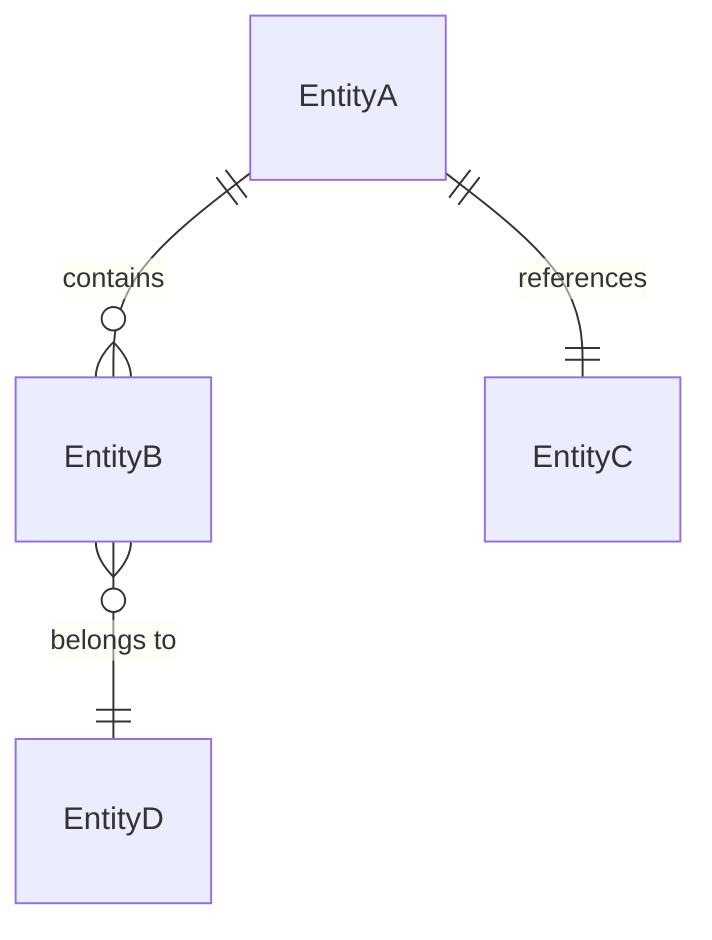
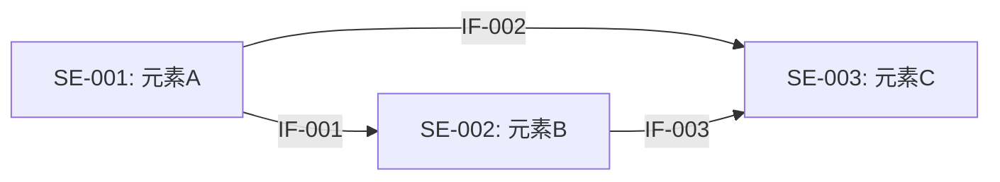
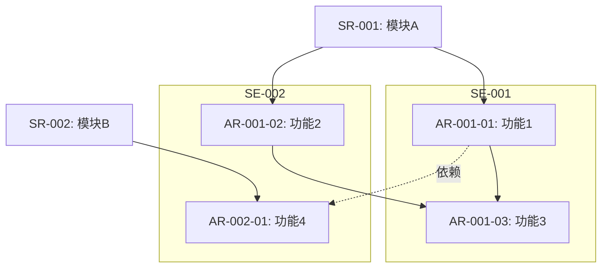

# SR-AR分解分配表

## Metadata
- **项目名称**: [Project Name]
- **版本号**: v1.0
- **创建日期**: [YYYY-MM-DD]
- **作者**: [System Engineer Name]
- **输入来源**:
  - 功能列表: `[path/to/功能列表.md]`
  - 组件划分: `[path/to/组件划分.md]`
  - 架构文档: `[path/to/架构文档.md]`
  - 代码库: `[repository URL or path]`

---

## 一、系统元素清单

### 1.1 架构元素定义

| 元素ID | 元素名称 | 元素类型 | 核心职责 | 所属子系统 | 依赖元素 |
|--------|---------|---------|---------|-----------|---------|
| SE-001 | [元素名称] | Service / Module / Middleware / Gateway / Storage / Adapter | [一句话核心职责描述] | [所属子系统名称] | SE-XXX, SE-YYY |
| SE-002 | [元素名称] | [类型] | [职责] | [子系统] | [依赖] |

### 1.2 功能对象定义

| 对象ID | 对象名称 | 所属架构元素 | 核心职责 | 聚合根/实体 |
|--------|---------|------------|---------|------------|
| FO-001 | [对象名称] | SE-XXX | [一句话职责] | [领域实体名称] |
| FO-002 | [对象名称] | SE-XXX | [职责] | [实体] |

### 1.3 领域数据模型

**核心数据对象**:

| 数据对象 | 所属系统元素 | 核心属性 | 生命周期 |
|---------|------------|---------|---------|
| [对象名] | SE-XXX | [关键属性列表] | [创建/使用/归档条件] |

**数据对象关系**:



**数据归属说明**:
- [数据对象A] 由 SE-XXX 拥有和管理
- [数据对象B] 由 SE-YYY 拥有，SE-XXX 通过接口访问

---

## 二、系统设计约束

### 2.1 技术约束

| 约束ID | 约束内容 | 来源 | 影响范围 |
|--------|---------|------|---------|
| TC-001 | [技术栈限制/兼容性要求/标准遵从] | [场景/利益相关人] | [影响的SR/系统元素] |
| TC-002 | [约束描述] | [来源] | [影响范围] |

### 2.2 性能约束

| 约束ID | 指标名称 | 指标要求 | 度量条件 | 影响范围 |
|--------|---------|---------|---------|---------|
| PC-001 | [如：响应时间] | [如：P99 < 200ms] | [负载条件描述] | [SR-XXX / SE-XXX] |
| PC-002 | [如：并发处理能力] | [如：1000 TPS] | [条件] | [影响范围] |

### 2.3 安全/韧性/隐私约束

| 约束ID | 约束类型 | 约束内容 | 合规要求 | 影响范围 |
|--------|---------|---------|---------|---------|
| SC-001 | 安全 / 韧性 / 隐私 | [约束描述] | [标准/法规，如GDPR] | [SR-XXX / SE-XXX] |

### 2.4 可靠性/可用性约束

| 约束ID | 指标名称 | 目标值 | 度量方式 | 影响范围 |
|--------|---------|--------|---------|---------|
| RC-001 | [如：系统可用性] | [如：99.9%] | [计算方式] | [SR-XXX / SE-XXX] |
| RC-002 | [如：故障恢复时间] | [如：RTO < 5min] | [度量方式] | [影响范围] |

### 2.5 易用性约束

| 约束ID | 约束内容 | 来源 | 影响范围 |
|--------|---------|------|---------|
| UC-001 | [易用性要求描述] | [来源] | [影响范围] |

---

## 三、系统级规格设计

### 3.1 [规格名称] 系统级规格设计

**设计思路**: [概述本规格的设计原则、思路]

**涉及系统功能**: [SR-XXX, SR-YYY, ...]

**规格分解**:

| 系统级指标 | 目标值 | 分解到系统功能 | 功能级指标 | 功能级目标值 | 分解依据 |
|-----------|--------|-------------|-----------|------------|---------|
| [全局性能指标] | [值] | SR-XXX | [功能级指标名] | [值] | [为什么这样分配] |
| | | SR-YYY | [功能级指标名] | [值] | [依据说明] |

### 3.2 [规格名称] 系统级规格设计

[重复3.1结构...]

---

## 四、SR-AR分解

### SR-001: [SR名称]

#### SR描述 (5W2H)

##### Who (谁)
**系统元素**: SE-XXX [系统元素名称]
- 关联架构元素: [架构元素名称和职责]
- 负责团队: [可选：团队名称]

##### When (何时)
**生命周期阶段**:
- [功能在系统生命周期的哪个阶段执行]
- 继承自: [IR-XXX] (如适用)

**触发条件**:
- [业务触发条件或时间点]

##### What (什么)
**功能描述**:
- [新增功能描述 / 功能变更点描述]

**发布件变化**:
- [ ] 代码模块: [具体模块名称和变化]
- [ ] 配置文件: [变化的配置项]
- [ ] 数据模型: [数据库schema变化]
- [ ] 接口变化: [API endpoint变化]
- [ ] 文档更新: [需要更新的文档]

**测试变化**:
- [如果仅测试工作] 测试变化原因: [分析导致测试变化的根本原因]
- [测试用例变化]: [新增/修改的测试场景]

##### Where (哪里)
**运行环境**:
- [运行平台：浏览器/服务器/移动端/边缘节点]

**依赖组件**:
- [外部服务A]: [依赖说明]
- [第三方库]: [版本和用途]

**部署位置**:
- [部署环境和位置描述]

##### Why (为何)
**需求来源**:
- 继承自: [IR-XXX] - [IR简要描述]

**业务价值**:
- [业务目标和预期收益]

##### How Much (多少)
**工作量估算**:
- 总工作量: [X]K (K=1000人时)
- 时间线: [X]个冲刺 / [Y]周
- 团队规模: [X]名开发 + [Y]名测试 + [Z]名其他

**估算分解** (如从IR分解而来):
```
[IR-XXX]: [Total]K
  +-- SR-001: [X]K
  +-- SR-002: [Y]K
  +-- SR-003: [Z]K
  Total: [Total]K (匹配IR估算)
```

**范围指标**:
- API端点数: [X]
- 数据表数: [Y]
- 测试用例数: [Z]
- [其他可量化指标]

##### How (如何)
**使用方式**:
- [用户或系统如何触发该功能]
- [主要使用场景描述]

**工作流程**:
1. [步骤1]
2. [步骤2]
3. [步骤3]

**集成点**:
- [与现有模块A的集成方式]
- [与现有模块B的集成方式]

**价值体现**:
- [如何解决用户痛点]
- [如何发挥业务作用]

---

#### 关联系统元素

| 系统元素ID | 元素名称 | 在本SR中的职责 | 是否新增 |
|-----------|---------|--------------|---------|
| SE-XXX | [元素A] | [在本SR中的具体职责] | 新增 / 修改 |
| SE-YYY | [元素B] | [在本SR中的具体职责] | 新增 / 修改 |

---

#### DFX需求

| DFX类型 | 需求ID | 需求描述 | 优先级 | 验证方式 |
|---------|--------|---------|--------|---------|
| 可靠性 | DFX-R-001 | [功能FMEA需关注的异常场景描述] | 高/中/低 | [故障注入测试/混沌工程/...] |
| 安全性 | DFX-S-001 | [需进行威胁建模的攻击面描述] | 高/中/低 | [渗透测试/安全审计/...] |
| 性能 | DFX-P-001 | [关键路径响应时间/吞吐量要求] | 高/中/低 | [压力测试/基准测试/...] |
| 可维护性 | DFX-M-001 | [可观测性/日志/监控要求] | 高/中/低 | [监控验收/...] |

---

#### 系统规格指标

| 指标名称 | 目标值 | 度量条件 | 来源(系统级规格) |
|---------|--------|---------|----------------|
| [如：接口响应时间] | [如：P99 < 100ms] | [如：并发100用户] | 规格3.1分解而来 |
| [指标] | [值] | [条件] | [来源] |

---

#### 分配的AR列表

##### AR-001-01: [AR名称]

**AR描述**:

**场景**:
- [具体使用场景描述]
- 前置条件: [执行前需满足的条件]
- 后置条件: [执行后的系统状态变化]

**分配系统元素**: SE-XXX [系统元素名称]

**实现方式**:

**选项1: 复用现有功能**
- 位置: `[模块/文件/函数路径]`
- 现有功能: [现有功能描述]
- 修改点:
  - [ ] 接口/服务扩充: [具体扩充内容]
  - [ ] 客户端/UI变更: [具体变更内容]
  - [ ] 其他: [其他修改]

**选项2: 新增功能**
- 调用接口: `[HTTP Method] [API endpoint]`
- 请求参数:
  ```json
  {
    "param1": "type and description",
    "param2": "type and description"
  }
  ```
- 成功处理:
  - 响应格式: `[响应结构]`
  - 后续动作: [成功时的行为]
- 失败处理:
  - 错误码: [错误码和含义]
  - 重试策略: [是否重试，如何重试]
  - 降级方案: [失败时的fallback]

**接口规格**:

| 项目 | 内容 |
|------|------|
| 接口ID | IF-XXX |
| 接口名称 | [接口名称] |
| 接口描述 | [接口功能目的] |
| 接口类型 | REST API / gRPC / Event / Internal Method / Message Queue |
| 提供方系统元素 | SE-XXX [名称] |
| 消费方系统元素 | SE-YYY [名称] |
| 输入要求/参数 | [参数名称、类型、必选/可选、值域约束] |
| 输出要求/参数 | [返回值类型、错误码定义、响应格式] |
| SLA定义 | 响应时间: [X]ms, 吞吐量: [Y]TPS, 可用性: [Z]% |
| 约束和注意事项 | [幂等性/并发控制/版本兼容/安全认证要求] |

**数据模型**:
- [ ] 新增表: `[table_name]` - [表用途]
  ```sql
  -- 表结构示例
  CREATE TABLE table_name (
    id INT PRIMARY KEY,
    field1 VARCHAR(255),
    ...
  );
  ```
- [ ] 修改表: `[table_name]` - [修改内容]
- [ ] 新增字段: `[table.field]` - [字段用途]

**DFX要求**:
- 可靠性: [异常处理策略、重试/降级/熔断方案]
- 安全性: [认证方式、授权粒度、数据保护措施]
- 性能: [响应时间预算、吞吐量要求、资源限制]

**工作量估算**: [X.X]K (小于等于 0.5K)
- 估算方法: [底层估算/对比估算/三点估算]
- 任务分解:
  - [Task 1]: [X] days
  - [Task 2]: [Y] days
  - ...
  - Buffer ([Z]%): [B] days
  - **Total**: [Total] days = [X.X]K

**依赖关系**:
- 依赖AR: [AR-XXX-XX] - [依赖说明]
- 被依赖: [AR-YYY-YY] - [被依赖说明]

**验收标准**:
- [ ] [验收标准1]
- [ ] [验收标准2]
- [ ] [验收标准3]

**分配团队**: [组件团队名称]

**优先级**: 高 / 中 / 低

**备注**: [其他需要说明的信息]

---

##### AR-001-02: [AR名称]

[重复上述AR-001-01的结构]

---

### SR-002: [SR名称]

[重复SR-001的完整结构]

---

## 五、接口规格汇总

| 接口ID | 接口名称 | 接口类型 | 提供方(系统元素) | 消费方(系统元素) | 输入概要 | 输出概要 | SLA | 关联AR |
|--------|---------|---------|----------------|----------------|---------|---------|-----|--------|
| IF-001 | [名称] | REST API | SE-XXX [名称] | SE-YYY [名称] | [主要入参] | [主要出参] | [响应时间/吞吐量] | AR-001-01 |
| IF-002 | [名称] | Event | SE-XXX | SE-YYY | [事件内容] | [处理结果] | [延迟要求] | AR-001-02 |
| IF-003 | [名称] | Internal | SE-XXX | SE-YYY | [参数] | [返回值] | [性能要求] | AR-002-01 |

### 接口依赖关系



---

## 六、分配需求汇总

| 系统需求编号 | 系统需求 | 分配需求编号 | 分配需求描述 | 系统元素 | 分配团队 |
|------------|---------|------------|------------|---------|---------|
| SR-001 | [SR名称] | AR-001-01 | [AR描述] | SE-XXX [名称] | [团队] |
| SR-001 | [SR名称] | AR-001-02 | [AR描述] | SE-YYY [名称] | [团队] |
| SR-002 | [SR名称] | AR-002-01 | [AR描述] | SE-XXX [名称] | [团队] |

---

## 七、DFX需求汇总

### 7.1 可靠性需求矩阵

此矩阵作为模块功能设计中 FMEA 分析的输入。

| SR/AR编号 | 功能描述 | 故障模式 | 故障影响 | 严重度 | 检测方式 | 缓解/恢复措施 |
|-----------|---------|---------|---------|--------|---------|-------------|
| AR-001-01 | [功能描述] | [可能发生的故障] | [对系统/用户的影响] | 高/中/低 | [如何检测故障] | [如何缓解和恢复] |
| AR-001-02 | [功能描述] | [故障模式] | [影响] | [严重度] | [检测] | [缓解] |

### 7.2 安全需求矩阵

此矩阵作为模块功能设计中安全检查的输入。

| SR/AR编号 | 功能描述 | 威胁场景 | 威胁等级 | 安全要求 | 防护措施 | 验证方式 |
|-----------|---------|---------|---------|---------|---------|---------|
| AR-001-01 | [功能描述] | [威胁场景描述] | 高/中/低 | [安全要求] | [防护措施] | [验证方法] |

### 7.3 性能需求矩阵

| SR/AR编号 | 功能描述 | 性能指标 | 目标值 | 度量条件 | 优化策略 |
|-----------|---------|---------|--------|---------|---------|
| AR-001-01 | [功能描述] | [如：响应时间] | [如：P99<100ms] | [负载条件] | [缓存/异步/批处理等] |

---

## 附录

### A. 术语表
| 术语 | 定义 | 示例 |
|-----|------|------|
| SR | System Requirement, 系统需求 | SR-001: 用户认证模块 |
| AR | Allocated Requirement, 分配需求 | AR-001-01: 登录接口实现 |
| IR | Initial Requirement, 初始需求 | IR-005: 支持第三方登录 |
| SE | System Element, 系统元素 | SE-001: auth-service |
| FO | Functional Object, 功能对象 | FO-001: TokenGenerator |
| IF | Interface, 接口 | IF-001: 用户认证接口 |
| DFX | Design for X, 面向X的设计 | 可靠性/安全性/性能/可维护性 |
| [其他项目术语] | [定义] | [示例] |

### B. 系统元素与团队映射
| 系统元素ID | 元素名称 | 元素类型 | 核心职责 | 负责团队 | 关联SR |
|-----------|---------|---------|---------|---------|--------|
| SE-001 | [元素A] | [类型] | [核心职责] | [Team A] | SR-001, SR-003 |
| SE-002 | [元素B] | [类型] | [核心职责] | [Team B] | SR-002 |

### C. 依赖关系图



### D. 变更记录
| 版本 | 日期 | 作者 | 变更内容 |
|-----|------|------|---------|
| v1.0 | YYYY-MM-DD | [作者] | 初始版本 |
| v1.1 | YYYY-MM-DD | [作者] | [变更说明] |

### E. 参考文档
- 功能列表: `[path/to/功能列表.md]`
- 组件划分文档: `[path/to/组件划分.md]`
- 架构设计: `[path/to/架构文档.md]`
- [其他参考文档]

---

**文档状态**: 草稿 / 评审中 / 已批准 / 已实施

**审批签字**:
- 系统工程师: _________________ 日期: _______
- 需求经理: _________________ 日期: _______
- 技术负责人: _________________ 日期: _______
