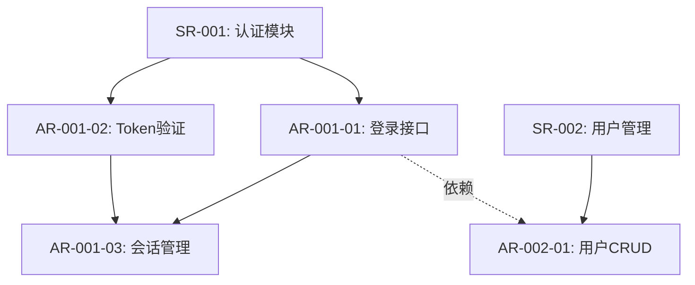

# SR-AR分解分配表

## Metadata
- **项目名称**: [Project Name]
- **版本号**: v1.0
- **创建日期**: [YYYY-MM-DD]
- **作者**: [System Engineer Name]
- **输入来源**:
  - 功能列表: `[path/to/功能列表.md]`
  - 组件划分: `[path/to/组件划分.md]`
  - 代码库: `[repository URL or path]`

---

## SR-001: [SR名称]

### SR描述 (5W2H)

#### Who (谁)
**系统/子系统**: [系统或子系统名称]
- 内部标识: [内部可理解的模块名称]
- 负责团队: [可选：团队名称]

#### When (何时)
**生命周期阶段**: 
- [功能在系统生命周期的哪个阶段执行]
- 继承自: [IR-XXX] (如适用)

**触发条件**:
- [业务触发条件或时间点]

#### What (什么)
**功能描述**:
- [新增功能描述 / 功能变更点描述]

**发布件变化**:
- [ ] 代码模块: [具体模块名称和变化]
- [ ] 配置文件: [变化的配置项]
- [ ] 数据模型: [数据库schema变化]
- [ ] 接口变化: [API endpoint变化]
- [ ] 文档更新: [需要更新的文档]

**测试变化**:
- [如果仅测试工作] 测试变化原因: [分析导致测试变化的根本原因]
- [测试用例变化]: [新增/修改的测试场景]

#### Where (哪里)
**运行环境**:
- [运行平台：浏览器/服务器/移动端/边缘节点]

**依赖组件**:
- [外部服务A]: [依赖说明]
- [外部服务B]: [依赖说明]
- [第三方库]: [版本和用途]

**部署位置**:
- [部署环境和位置描述]

#### Why (为何)
**需求来源**:
- 继承自: [IR-XXX] - [IR简要描述]

**业务价值**:
- [业务目标和预期收益]

#### How Much (多少)
**工作量估算**:
- 总工作量: [X]K (K=1000人时)
- 时间线: [X]个冲刺 / [Y]周
- 团队规模: [X]名开发 + [Y]名测试 + [Z]名其他

**估算分解** (如从IR分解而来):
```
[IR-XXX]: [Total]K
  ├─ SR-001: [X]K
  ├─ SR-002: [Y]K
  └─ SR-003: [Z]K
  Total: [Total]K ✅ (匹配IR估算)
```

**范围指标**:
- API端点数: [X]
- 数据表数: [Y]
- 测试用例数: [Z]
- [其他可量化指标]

#### How (如何)
**使用方式**:
- [用户或系统如何触发该功能]
- [主要使用场景描述]

**工作流程**:
1. [步骤1]
2. [步骤2]
3. [步骤3]
...

**集成点**:
- [与现有模块A的集成方式]
- [与现有模块B的集成方式]

**价值体现**:
- [如何解决用户痛点]
- [如何发挥业务作用]

---

### 关联组件
| 组件名称 | 职责说明 | 是否新增 |
|---------|---------|---------|
| [组件A] | [在本SR中的职责] | ☐ 新增 ☑ 修改 |
| [组件B] | [在本SR中的职责] | ☑ 新增 ☐ 修改 |

---

### 分配的AR列表

#### AR-001-01: [AR名称]

**AR描述**:

**场景**:
- [具体使用场景描述]
- 前置条件: [如果有]
- 后置条件: [如果有]

**实现方式**:

**选项1: 复用现有功能**
- 位置: `[模块/文件/函数路径]`
- 现有功能: [现有功能描述]
- 修改点:
  - [ ] 后端接口扩充: [具体扩充内容]
  - [ ] 前端功能扩展: [具体扩展内容]
  - [ ] 其他: [其他修改]

**选项2: 新增功能**
- 调用接口: `[HTTP Method] [API endpoint]`
- 请求参数:
  ```json
  {
    "param1": "type and description",
    "param2": "type and description"
  }
  ```
- 成功处理:
  - 响应格式: `[响应结构]`
  - 后续动作: [成功时的行为]
- 失败处理:
  - 错误码: [错误码和含义]
  - 重试策略: [是否重试，如何重试]
  - 降级方案: [失败时的fallback]

**数据模型**:
- [ ] 新增表: `[table_name]` - [表用途]
  ```sql
  -- 表结构示例
  CREATE TABLE table_name (
    id INT PRIMARY KEY,
    field1 VARCHAR(255),
    ...
  );
  ```
- [ ] 修改表: `[table_name]` - [修改内容]
- [ ] 新增字段: `[table.field]` - [字段用途]

**工作量估算**: [X.X]K (≤ 0.5K)
- 估算方法: [底层估算/对比估算/三点估算]
- 任务分解:
  - [Task 1]: [X] days
  - [Task 2]: [Y] days
  - ...
  - Buffer ([Z]%): [B] days
  - **Total**: [Total] days = [X.X]K

**依赖关系**:
- 依赖AR: [AR-XXX-XX] - [依赖说明]
- 被依赖: [AR-YYY-YY] - [被依赖说明]

**验收标准**:
- [ ] [验收标准1]
- [ ] [验收标准2]
- [ ] [验收标准3]

**分配团队**: [组件团队名称]

**优先级**: ☐ 高 ☑ 中 ☐ 低

**备注**: [其他需要说明的信息]

---

#### AR-001-02: [AR名称]

[重复上述AR-001-01的结构]

---

## SR-002: [SR名称]

[重复SR-001的完整结构]

---

## 附录

### A. 术语表
| 术语 | 定义 | 示例 |
|-----|------|------|
| SR | System Requirement, 系统需求 | SR-001: 用户认证模块 |
| AR | Allocated Requirement, 分配需求 | AR-001-01: 登录接口实现 |
| IR | Initial Requirement, 初始需求 | IR-005: 支持第三方登录 |
| [其他项目术语] | [定义] | [示例] |

### B. 组件清单
| 组件ID | 组件名称 | 职责 | 负责团队 |
|-------|---------|------|---------|
| C-001 | [组件A] | [核心职责] | [Team A] |
| C-002 | [组件B] | [核心职责] | [Team B] |

### C. 依赖关系图


### D. 变更记录
| 版本 | 日期 | 作者 | 变更内容 |
|-----|------|------|---------|
| v1.0 | YYYY-MM-DD | [作者] | 初始版本 |
| v1.1 | YYYY-MM-DD | [作者] | [变更说明] |

### E. 参考文档
- 功能列表: `[path/to/功能列表.md]`
- 组件划分文档: `[path/to/组件划分.md]`
- 架构设计: `[path/to/架构文档.md]`
- [其他参考文档]

---

**文档状态**: ☐ 草稿 ☐ 评审中 ☐ 已批准 ☐ 已实施

**审批签字**:
- 系统工程师: _________________ 日期: _______
- 需求经理: _________________ 日期: _______
- 技术负责人: _________________ 日期: _______
