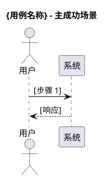
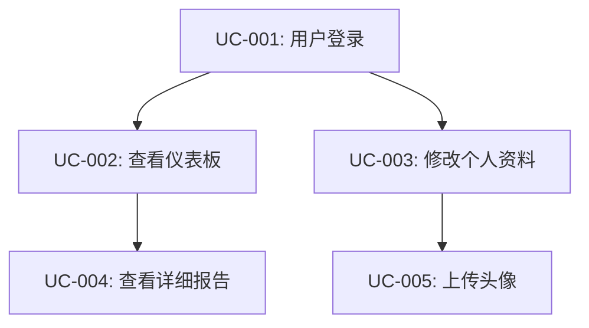
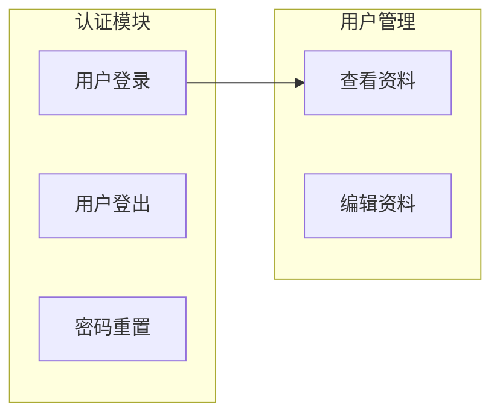

# 用例分析技能

## 核心职责

将高层级的业务场景细化为可执行的详细用例规范 (Detailed Use Case Specification)。

## 工作流程

### 输入处理
- 读取 `.hyper-designer/scenarioAnalysis/{功能名}场景.md`
- 解析场景中的参与者、触发条件、前置条件、主流程、备选流程、异常流程、后置条件、业务规则

### 用例识别
每个场景可能包含一个或多个用例：
- **主流程** → 主用例
- **备选流程** → 备选用例或用例的变体  
- **异常流程** → 异常处理用例

### 用例粒度控制
```
太粗：整个业务流程作为一个用例
合适：单一目标、明确输入输出、独立可测试
太细：每个UI交互都是一个用例
```

## 输出格式

### 文档命名
`{功能名}用例.md`

### 文档结构
```markdown
# {功能名}用例

## 汇总总结
[确认关联的场景及涉及的用例列表]

## 用例描述

### 用例 1: {用例名称}

| 简要说明 | Actor | 前置条件 | 最小保证 | 成功保证 | 触发事件 | 主成功场景 | 扩展场景 | DFX 属性 |
|---------|-------|---------|---------|---------|---------|-----------|---------|---------|
| [一句话描述] | [角色] | [条件列表] | [最低保证] | [成功保证] | [触发事件] | 1. [步骤1]<br>2. [步骤2]<br>3. [步骤3] | [扩展描述] | 性能: <Xms<br>安全: [要求]<br>可用性: [要求] |



### 用例 2: {用例名称}
...

## 数据字典和附加描述
[关键数据项定义，如字段类型、约束、示例值等]

## 是否影响架构
是/否 [如果"是"，简要解释影响点]
```

## 用例发现技巧

### 从场景提取用例
```
1. "这个场景中，用户的核心目标是什么？" → 主用例
2. "达成这个目标有几种路径？" → 识别备选用例
3. "每条路径的输入和输出是什么？" → 定义用例边界
```

### 细化用例规格
```
4. "什么情况下这个用例会失败？" → 识别异常流程
5. "用例成功和失败后，系统状态有什么不同？" → 定义后置条件
6. "这个用例依赖哪些其他用例？" → 建立依赖关系
```

### 验证用例完整性
```
7. "这个用例的输入从哪里来？" → 确认数据来源
8. "这个用例的输出被谁使用？" → 确认数据流向
9. "如何验证这个用例正确实现了？" → 定义验收标准
```

## 场景到用例的映射

```
场景参与者 → 用例参与者 (Actor)
场景触发条件 → 用例触发事件 (Trigger)
场景前置条件 → 用例前置条件 (Preconditions)
场景主流程 → 用例主成功场景 (Main Success Scenario)
场景备选流程 → 用例扩展场景 (Extensions)
场景异常流程 → 用例异常流程 (Exception Flows)
场景后置条件 → 用例成功保证/最小保证 (Success/Minimal Guarantees)
场景业务规则 → 用例业务规则
```

## 用例完整性检查清单

### 表格内容检查
- [ ] 每个用例都有完整的9列内容
- [ ] 主成功场景步骤清晰、可执行
- [ ] 扩展场景覆盖主要变体
- [ ] DFX 属性有量化指标

### 流程完整性检查
- [ ] 主流程步骤清晰、可执行
- [ ] 扩展场景覆盖主要变体
- [ ] 每个分支都有明确的返回或结束

### 质量标准检查
- [ ] 业务规则明确、无歧义
- [ ] DFX属性有量化指标
- [ ] PlantUML 图准确反映主成功场景

## 用例编号规则

**推荐编号方案：**
```
UC-[模块代码][序号]

示例：
- UC-AUTH-001: 用户登录
- UC-AUTH-002: 用户登出
- UC-USER-001: 查看用户资料
- UC-USER-002: 编辑用户资料
```

**编号原则：**
- 保持一致性
- 便于引用和追溯
- 预留扩展空间（如：001-099 为核心功能，100-199 为管理功能）

## 常见陷阱与应对

| 陷阱 | 识别信号 | 应对策略 |
|------|---------|---------|
| **用例过于复杂** | 一个用例包含多个业务目标 | 拆分为多个独立用例 |
| **用例过于简单** | 仅描述UI操作，无业务逻辑 | 关注业务目标，而非界面交互 |
| **表格内容模糊** | 某列填写"待定"或留空 | 使用具体示例补充规格 |
| **缺少扩展场景** | 只有"快乐路径" | 系统性补充扩展场景 |
| **DFX无量化指标** | "性能快"、"高可用" | 转化为具体可量化的标准 |
| **用例重复** | 多个用例描述相同功能 | 合并或明确差异点 |

## 用例关系图

**依赖关系可视化：**
使用Mermaid绘制用例依赖关系



**用例分组：**


## 草稿管理指导

**用例分析草稿结构：**
```markdown
# 用例分析工作草稿

## 场景到用例映射
### 场景S-001 → 用例
- UC-001: [用例名] - 状态：草稿/完成
- UC-002: [用例名] - 状态：草稿/完成

### 场景S-002 → 用例
- UC-003: ...

## 用例列表（持续更新）
### 核心用例（高优先级）
- UC-001: [用例名] - [简述] - 状态：草稿/完成
- UC-002: ...

### 辅助用例（中优先级）
- UC-010: ...

### 管理用例（低优先级）
- UC-020: ...

## 用例依赖关系
- UC-001 → UC-002, UC-003 (前置)
- UC-004 ← UC-002 (后续)
- UC-005 || UC-006 (可并发)

## 识别的问题
- [ ] 问题1：UC-003的输入格式不明确
- [ ] 问题2：UC-007与UC-008存在功能重叠

## 用户反馈记录
### Q: [关于用例X的问题]
A: [用户回答]
推导：[调整UC-00X的...]

## 参考资料应用
- 场景文档：已全部映射
- 需求文档FR-001 → UC-003, UC-004
```

## 实战建议

### 与用户交互技巧

**用例规格对话模式：**
```
1. "让我们明确一下，当用户[执行动作]时，需要提供哪些信息？"
2. "系统处理后，应该返回什么结果？格式是怎样的？"
3. "如果[异常情况]发生，系统应该如何响应？用户能做什么？"
4. "如何判断这个用例成功实现了？有什么具体的标准？"
```

**数据字典细化技巧：**
```
- 使用具体例子："比如用户输入邮箱 'user@example.com'..."
- 展示JSON格式："返回的数据结构是这样的：{...}"
- 明确约束："密码必须包含8-20个字符，至少一个大写字母..."
```

### 处理棘手情况

**情况1：数据字典内容难以确定**
```
策略：
1. 从最简单的情况开始定义
2. 使用现有API或系统作为参考
3. 与用户一起构造示例数据
4. 迭代完善，不追求一次到位
```

**情况2：扩展场景难以穷举**
```
策略：
1. 聚焦高频和高影响场景
2. 分类：输入验证错误、权限错误、业务规则违反、系统错误
3. 参考行业标准错误码
4. 记录"待确认场景"列表
```

**情况3：用例边界模糊**
```
策略：
1. 明确单一职责原则：一个用例一个目标
2. 识别清晰的前置和后置条件
3. 如果用例太大，考虑拆分
4. 如果用例太小，考虑合并
```

## 参考资料

- 详细的用例分析工作流指导：参见 [references/use-case-workflow.md](references/use-case-workflow.md)
- DFX属性详细说明：参见 [references/dfx-guidelines.md](references/dfx-guidelines.md)
- 用例模板示例：参见 [references/use-case-template.md](references/use-case-template.md)

## 成功标准

**该阶段成功的标志：**
1. 所有场景都已转化为用例
2. 每个用例表格内容完整、清晰
3. 每个用例有对应的 PlantUML 主成功场景图
4. 数据字典覆盖关键数据项
5. 架构影响评估已完成
6. 用例依赖关系清晰
7. 无遗留的高优先级问题
8. 用户确认用例准确反映需求
9. 通过HCritic审查

**准备进入下一阶段的信号：**
- 用例覆盖所有功能需求和场景
- 用例规格详细、可作为开发依据
- 无阻塞性问题
- 文档质量通过审查
