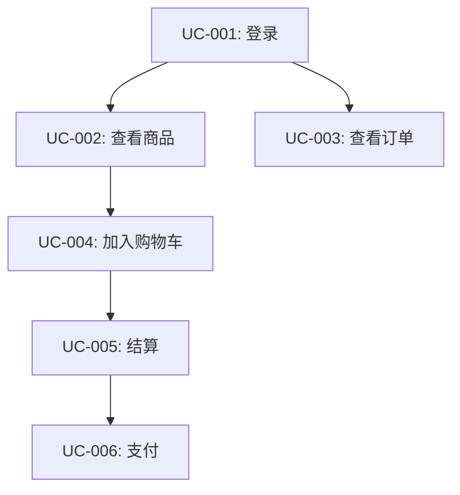

# 用例分析工作流详细指南

## 工作流概述

用例分析是连接需求与实现的关键环节，将高层级场景转化为可执行的详细规格。

## 分析步骤

### 步骤1: 场景文档解析

**读取场景文档**
- 文档路径：`.hyper-designer/scenarioAnalysis/{功能名}场景.md`
- 提取关键元素：
  - 参与者 (Actors)
  - 触发条件 (Trigger)
  - 前置条件 (Preconditions)
  - 主流程 (Main Flow)
  - 备选流程 (Alternative Flows)
  - 异常流程 (Exception Flows)
  - 后置条件 (Postconditions)
  - 业务规则 (Business Rules)

**映射到用例元素**
```
场景参与者 → 用例Actor
场景触发条件 → 用例触发事件
场景前置条件 → 用例前置条件
场景主流程 → 用例主成功场景
场景备选流程 → 用例扩展场景
场景异常流程 → 用例异常流程
场景后置条件 → 用例成功保证/最小保证
场景业务规则 → 用例业务规则
```

### 步骤2: 用例识别

**识别原则**
1. **单一职责**: 一个用例一个业务目标
2. **可测试性**: 能够独立验证
3. **完整性**: 有明确的输入和输出
4. **原子性**: 不依赖其他用例完成核心功能

**识别方法**
```
场景: 用户购买商品

识别出的用例:
- UC-001: 浏览商品
- UC-002: 加入购物车
- UC-003: 结算订单
- UC-004: 支付
- UC-005: 查看订单状态
```

**用例粒度检查**
```
太粗:
❌ UC-001: 用户购物 (包含浏览、加购、结算、支付)

合适:
✅ UC-001: 浏览商品
✅ UC-002: 加入购物车
✅ UC-003: 结算订单

太细:
❌ UC-001: 点击搜索框
❌ UC-002: 输入搜索词
❌ UC-003: 点击搜索按钮
```

### 步骤3: 用例规格定义

#### 3.1 基本信息
- **用例ID**: 遵循编号规则
- **用例名称**: 动词+对象，如"创建订单"
- **用例描述**: 一句话说明目的和价值

#### 3.2 条件定义
- **前置条件**: 执行前必须满足的条件
- **最小保证**: 无论成功与否的保证
- **成功保证**: 成功完成后的保证
- **触发事件**: 启动用例的动作

#### 3.3 Actor定义
- **主要Actor**: 发起用例的用户/系统
- **次要Actor**: 被通知或支持的用户/系统
- **系统Actor**: 外部交互系统

#### 3.4 场景定义
- **主成功场景**: 正常流程，编号步骤
- **扩展场景**: 备选路径，明确分支点和返回点
- **异常流程**: 错误处理，包含恢复策略

#### 3.5 输入输出定义
**输入规格**
- 名称: 参数名
- 类型: 数据类型
- 来源: 用户输入/系统生成/外部系统
- 约束: 必填/可选、格式、范围
- 示例: 具体值

**输出规格**
- 名称: 返回值名
- 类型: 数据类型
- 格式: JSON/XML/HTML等
- 约束: 格式规范
- 示例: 具体值

#### 3.6 DFX属性定义
- **性能**: 响应时间、吞吐量
- **安全**: 认证、授权、加密
- **可用性**: 错误提示、用户体验
- **可靠性**: 容错、恢复
- **可维护性**: 日志、监控
- **可扩展性**: 并发、负载

#### 3.7 其他定义
- **业务规则**: 约束和策略
- **验收标准**: 可测试的检查项
- **依赖关系**: 前置/后续/并发用例

### 步骤4: 用例关系建立

**依赖关系类型**
```
前置用例: UC-A 必须在 UC-B 之前完成
后续用例: UC-B 在 UC-A 成功后触发
并发用例: UC-C 和 UC-D 可同时执行
包含用例: UC-E 包含 UC-F 作为子流程
扩展用例: UC-G 在特定条件下扩展 UC-H
```

**关系可视化**


### 步骤5: 用例汇总

**生成汇总表**
```markdown
| 用例ID | 用例名称 | 用例描述 | 前置条件 | 最小保证 | 成功保证 | 触发事件 | Actor | 主成功场景 | 扩展场景 | DFX属性 |
```

**用例分组**
- 核心用例 (高优先级)
- 辅助用例 (中优先级)
- 管理用例 (低优先级)

### 步骤6: 质量检查

**完整性检查**
- [ ] 所有场景都映射到用例
- [ ] 每个用例都有唯一ID
- [ ] 输入输出规格完整
- [ ] 主/扩展/异常场景齐全
- [ ] DFX属性定义明确
- [ ] 验收标准可测试

**一致性检查**
- [ ] 术语使用一致
- [ ] 格式规范统一
- [ ] 编号规则遵循
- [ ] 依赖关系无循环

**正确性检查**
- [ ] 用例粒度合适
- [ ] 无重复用例
- [ ] 业务逻辑正确
- [ ] 异常覆盖全面

## 常见问题处理

### Q1: 如何确定用例边界？
**A**: 用例边界由单一业务目标决定。如果涉及多个业务目标，考虑拆分；如果只是一个UI操作，考虑合并。

### Q2: 扩展场景和异常流程的区别？
**A**: 
- **扩展场景**: 业务逻辑的变体，如修改地址、使用优惠券，最终仍能完成用例
- **异常流程**: 错误情况，如验证失败、库存不足，可能无法完成用例

### Q3: 如何处理复杂的输入输出？
**A**: 
1. 先定义最简单的情况
2. 使用具体示例说明
3. 提供JSON/XML格式示例
4. 迭代完善，不追求一步到位

### Q4: DFX属性如何量化？
**A**:
- 性能: 响应时间 < Xms (P95/P99)
- 可用性: 99.9% 可用性
- 并发: 支持 X 并发用户
- 安全: 符合 OWASP Top 10

### Q5: 如何处理多个Actor？
**A**: 
- 明确区分主要Actor和次要Actor
- 描述每个Actor的目标和职责
- 定义Actor之间的交互关系

## 最佳实践

1. **从用户视角出发**: 描述用户做什么，而不是系统怎么做
2. **使用业务语言**: 避免技术术语，使用业务领域的词汇
3. **保持简洁清晰**: 避免冗长描述，要点明确
4. **提供具体示例**: 用具体数据和场景说明抽象概念
5. **迭代完善**: 先完成主干，再补充细节
6. **团队协作**: 与业务、开发、测试人员共同评审

## 检查清单

### 用例定义检查
- [ ] 用例名称清晰、动词开头
- [ ] 用例描述一句话说明价值
- [ ] Actor定义完整
- [ ] 前置条件具体可验证
- [ ] 触发事件明确

### 场景定义检查
- [ ] 主流程步骤编号清晰
- [ ] 扩展场景标识分支点
- [ ] 异常流程包含恢复策略
- [ ] 场景描述用户动作和系统响应

### 输入输出检查
- [ ] 每个输入都有类型和约束
- [ ] 每个输出都有格式和示例
- [ ] 数据流向清晰
- [ ] 边界条件说明

### DFX属性检查
- [ ] 性能指标可量化
- [ ] 安全要求具体
- [ ] 可用性标准明确
- [ ] 可靠性策略定义

### 文档质量检查
- [ ] 格式规范统一
- [ ] 术语使用一致
- [ ] 无拼写和语法错误
- [ ] 结构清晰易读
